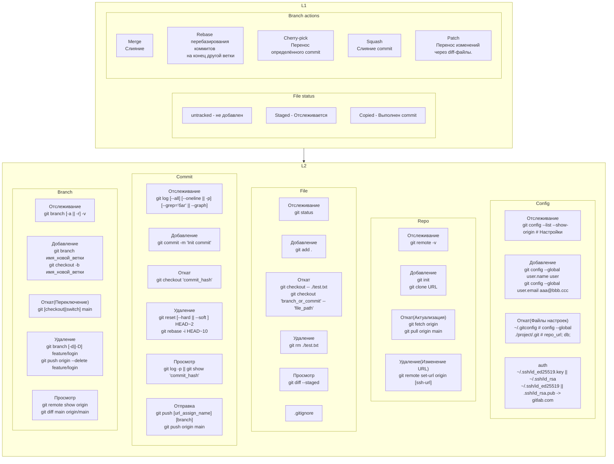

# [git](https://git-scm.com/)



## Rebase

```shell
main: com1 -> com2 -> com3 -> com4
                      \
dev:                   dev1 -> dev2

git checkout dev
git rebase main

main: com1 -> com2 -> com3 -> com4
                                  \
dev:                               dev1' -> dev2'


git checkout main
git rebase dev

dev: com1 -> com2 -> com3 -> dev1 -> dev2
                                  \
main:                              com4'
```


```shell
git init

git clone 

# Полезно, при изменении http на ssh 
git remote set-url origin [ssh-url]


# Структура ветки
git log --all --graph

# Статус
git status

# Удаление файла из кеша
git rm --cached .idea/.gitignore

# Чистка последнего коммита
git checkout main # Выбор локальной ветки
git commit --amend # Редактирует локальную ветку
git push --force # Принудительно пушит ветку

# Чистка всех коммитов
git rebase -i HEAD~10
git push --force

# Удаление последнего коммита локально
git reset HEAD^

```