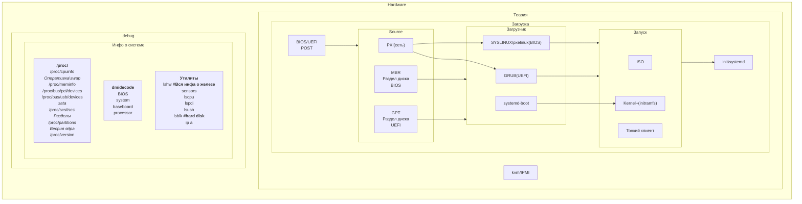
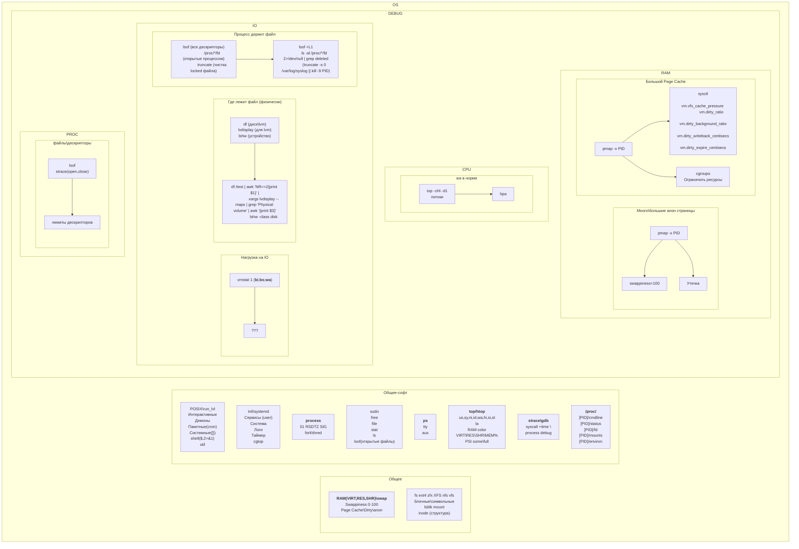
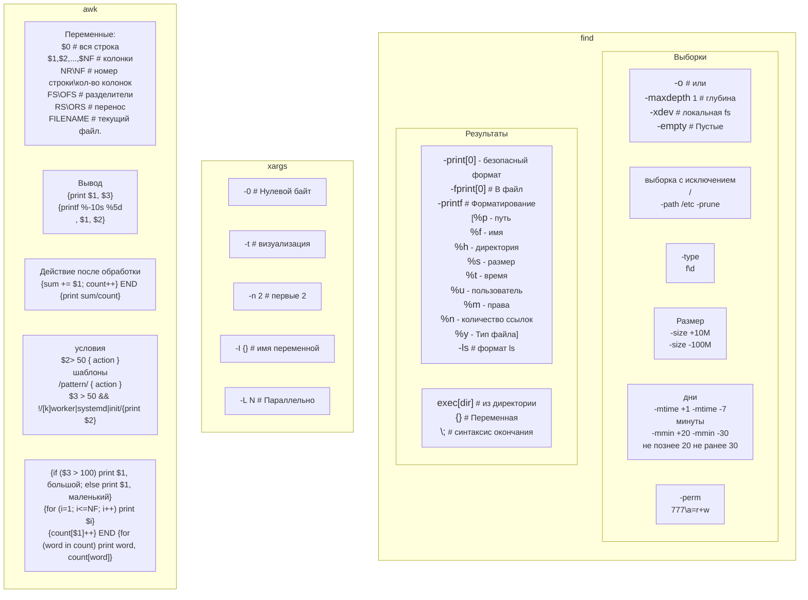
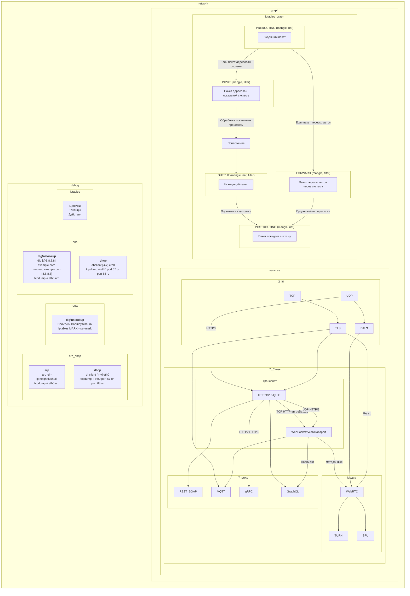

1. Основы Linux (глубоко)
   DevOps сильно зависит от Linux, поэтому важно понимать:

Файловая система (структура, права chmod/chown)

Процессы (ps, top, htop, kill, systemd)

Сети (ip, netstat, ss, tcpdump, iptables/nftables)

Bash-скриптинг (циклы, условия, grep/awk/sed)

Пакетные менеджеры (apt, yum, dpkg, rpm)

🔹 Уровень: Уметь администрировать сервер, писать скрипты для автоматизации.

2. Системы контроля версий (Git — уверенно)
   Основные команды (clone, commit, push, pull, merge, rebase)

Работа с ветками (git flow, разрешение конфликтов)

Платформы: GitHub, GitLab, Bitbucket

🔹 Уровень: Свободно работать с Git, понимать CI/CD интеграцию.

3. Основы сетей (уверенно)
   OSI модель (особенно L3-L7)

TCP/IP (порты, NAT, DNS, HTTP/HTTPS)

Базовая диагностика (ping, traceroute, curl, dig, nslookup)

Firewalls и Load Balancers (Nginx, HAProxy)

🔹 Уровень: Понимать, как работают сети в облаке и на серверах.

4. Контейнеризация (Docker — глубоко, Kubernetes — базово)
   Docker: образы, сети, volumes, Dockerfile, Docker Compose

Kubernetes: Pods, Deployments, Services, Namespaces (можно без углубления в администрирование кластера)

🔹 Уровень: Уметь упаковывать приложения в контейнеры и деплоить.

5. Инфраструктура как код (IaC — уверенно)
   Terraform (основные ресурсы, state-файлы, модули)

Ansible (плейбуки, инвентари, roles)

🔹 Уровень: Уметь описать инфраструктуру в коде.

6. CI/CD (уверенно)
   GitHub Actions / GitLab CI / Jenkins

Артефакты (Docker Hub, Nexus, Artifactory)

Стратегии деплоя (blue-green, canary)

🔹 Уровень: Настроить пайплайн сборки и деплоя.

7. Облака (AWS/GCP/Azure — базово + сертификация будет плюсом)
   Основные сервисы (EC2, S3, VPC, IAM, Lambda)

CLI и SDK

🔹 Уровень: Развернуть простой сервис в облаке.

8. Мониторинг и логи (базово)
   Prometheus + Grafana (метрики)

ELK Stack (логи)

🔹 Уровень: Настроить алерты и сбор метрик.

9. Основы программирования (Python/Go — базово)
   Чтение и написание простых скриптов (например, для автоматизации).

................

1.
* В файловой системе все сущности являются файлами. Процессы взаимодействуют с железом через ядро (POSIX). Основные типы файлов: Виртуальные и физические.
* inode - уникальный идентификатор файла в файловой системе, он существует пока есть хотябы одна жесткая ссылка на него. Посмотреть можно командой stat.
* Жесткая ссылка это ссылка на inode. Пока такая ссылка существует - файл существует. По сути все жесткие ссылки это фактически один файл. Символическая ссылка - просто переадресовывает на жесткую ссылку, изменение символической ссылки не повлияет на файл, можно ссылаться на файлы в других файловых системах.
* umask - шаблон прав при создании файла.
* find / -type f -mtime 7
2.
* rwx - read wreate exec. Права доступа к файлу или директории. Могут быть настроены для владельца группы и анонимного пользователя. Могут быть заданы числовыми значениями. Пример: chmod 744
* С помощью команд chmod, chown, chgrp задаются права доступа и владельцы. Для рекурсивного выполнения нужен ключ -R
* setuid, setgid - права для пользователя или группы. sticky bit - оставляет права на переименование или удаления файла только владельцу.
* Добавить ограничения в sudoers (visudo)
3.
* ps - выводит текущие запущенные процессы (удобно для скриптов). top, htop - выводят список процессов в реальном времени (htop более удобен)
* Сигналы - один из методов взаимодействия между процессами. Отправить сигналы можно командой kill (SIGKILL - мгновенное завершение. SIGTERM - мягкое завершение)
* Для запуска любого процесса в фоне, в конце команды можно поставить &. Вернуть командой fg.
* Демоны - процессы работающие в фоновом режиме. Можно создать через service и запустит systemctl start
* `ss -ntuap | grep 8080` или lsof -i :8080 Найти нужный pid и выполнить kill
4.
* ss -ntuap или lsof -i
* nc -zv 80; curl -r -l -v URL
* изменить конфигурацию netplan и выполнить netplan try netplan apply
* iptables/nftables - правила для входящих и исходящих пакетов. iptables -A --dport 22 -j DROP
* Маршрутизация - правила по которым трафик отправляется между сетями. Существуют 3 стандартные таблицы local, main, default. И пользовательские таблицы. `ip route show table local`
5.
* lsblk - информация о смонтированных блочных устройствах. fdisk - информация о форматировании диска. df - список всех смонтированных дисков. du - просмотр занятого пространства.
* внести изменения в файл /etc/fstab и выполнить mount -A; или для mount указать файловую систему диск и папку.
* LVM - абстракция над блочной файловой системой. Позволяет взаимодействовать операционной системе с дисками вне зависимости от их физической структуры. Создать физический том (pvcreate) --> создать группу томов (vgcreate) --> создать логический том (lvcreate) --> отформатировать (mkfs) --> смонтировать (mount).
* Добавить физический том в группу (vgextend) --> добавить пространство в логический том (lvextend) --> изменить размер логического тома (resize2fs)
6.
* BIOS/UEFI - делают проверку POST --> GRUB - пространство на диске с загрузчиком. --> GRUB загружает ядро --> запускается init (systemd)
* systemd: запускает процессы параллельно; Следит за состоянием процессов и поднимает упавшие; Может более гибко управлять ресурсами (cgroup); Может работать как cron.
* Просмотр логов: journalctl -f -u service_name; tail -f /var/log/syslog
* через cron: crontab -e добавить @reboot /path/to/your_script.sh; Через создание сервиса `systemctl enable my_service`; скрипты /etc/rc*
7.
* command &> /logs.log или command > /logs.log 2>&1
* pipe - методы общения между процессами: Конвейер - односторонняя передача результата следующей команде (При этом создаётся дочерний процесс); Именованный pipe - fifo куда добавляются данные и читаются другим процессом. socket - виртуальный файл, со структурой yaml или json; hsared memory - общая память процессов (в связке с ней используются семафоры и мьютексы.


...................


# OS
## Процессы
* Отдельная программа для которой выделено место в адресном пространстве.
* На каждый процесс выделяется процессорное время.
  * Управляется приоритетом.
* Состояния

* 

# KMS
  ## Общее
  ### Порядок загрузки ОС
BIOS/UEFI  
POST  
MBR/GPT/PXE  
SYSLINUX/GRUB  
kernel  
init/systemd  

  ### omm killer
Очистка оперативной памяти при нехватке. 
  ## Сеть
  ### Протоколы
ICMP (ping) - протокол ошибок в сети без подтверждения получения.
  ### Модель OSI
| nn | Уровень                      | Тип данных | Функции                                   | Пример                    |
|----|:-----------------------------|:-----------|-------------------------------------------|---------------------------|
| 7  | Прикладной (application)     | Данные     | Службы                                    | HTTP, FTP, SSH, WebSocket | 
| 6  | Представления (presentation) | Данные     | Шифрование                                | SSL, gzip                 |
| 5  | Сеансовый (session)          | Данные     | Управление сеансом                        | PAP, L2TP                 |
| 4  | Транспортный (transport)     | Сегменты   | Прямая связь                              | TCP, UDP                  |
| 3  | Сетевой (network)            | Пакеты     | Маршрутизация и логическая адресация (IP) | IPv4, IPv6, ICMP          |
| 2  | Канальный (data link)        | Кадры      | Физическая адресация (MAC)                | 802.22, Ethernet          |
| 1  | Физический (physical)        | Биты       | Сигнал                                    | RG45                      |
  ### Ошибки http

| код | Описание                                                                                                                                                                                                                                                                       |
|:---:|:-------------------------------------------------------------------------------------------------------------------------------------------------------------------------------------------------------------------------------------------------------------------------------|
| 1XX | информационные коды. Они отвечают за процесс передачи данных. Это временные коды, они информируют о том, что запрос принят и обработка будет продолжаться.                                                                                                                     |
| 2XX | успешная обработка. Запрос был получен и успешно обработан сервером.                                                                                                                                                                                                           |
| 3XX | перенаправление (редирект). Эти ответы сервера гласят, что нужно предпринять дальнейшие действия для выполнения запроса. Например, сделать запрос по другому адресу.                                                                                                           |
| 4XX | ошибка пользователя. Это значит, что запрос не может быть выполнен по его вине.                                                                                                                                                                                                |
| 5XX | ошибка сервера. Эти коды возникают из-за ошибок на стороне сервера. В данном случае пользователь всё сделал правильно, но сервер не может выполнить запрос. Для кодов этого класса сервер обязательно показывает сообщение, что не может обработать запрос и по какой причине. |

  ### Файловый дескриптор

  ## Отладка системы
  ### Ядро и процессы
```shell
# свободная оперативка
free
# strace список системных вызовов (ls это команда)
strace -c ls
# iostat загрузка диска
iostat -xtc
# ps - информация о процессах
ps aux # Все процессы с pid и пользователями
ps auxf # Все процессы деревом
# kill - передает сигналы процессу
kill -9 pid # SIGKILL
kill -15 pid # SIGTERM
systemctl status # Просмотр состояния сервисов.

```
  ### Сеть
```shell
# мониторинг потерянных пакетов
ifconfig 
# ss (netstat)
## показать порты | tcp | udp | all | process
ss -ntuap
# watch просмотр в реальном времени.
watch ss -ntuap
# nc сканер портов
## без отправки данных | verbose | UDP (без ключа tcp)
nc -z -v -u 192.168.2.1 1-80 2>&1>/dev/null | grep succeeded
# telnet старый протокол соединения (проверка портов)
## DNS имя или IP | PORT
telnet host 22
# arp список известных MAC
## -n без dns имён
arp -n
# resolvectl flush-caches сброс кэша DNS
resolvectl flush-caches
# tcpdump мониторинг трафика (wireshark)
## весь трафик | с хоста 
tcpdump host 192.168.2.1
## не преобразовывать в dns-имя | интерфейс | исходящий трафик с ip | исключить 22 порт
tcpdump -nn -i eth0 src 192.168.2.1 and not port 22
## 10 пакетов | интерфейс | ip:port | содержимое пакета | порт
tcpdump -c10 -i eth0 -nn -A port 22
## verbose | не преобразовывать в dns-имя | интерфейс | протокол
tcpdump -vvv -ni eth0 vrrp
```

  ### WEB
```shell
# curl проверка удаленного web сервера
# скачать файл
## verbose | визуальная загрузка | возобновить при разрыве | игнор сертификатов | редирект | сохранение в текущую директорию 
curl -vvv -# -C 999 -k -L -O https://192.168.2.1/pxe/user-data
# сохранить страницу в файл
curl -v -k -L -o ./test_curl.txt  https://google.com


```

  ## bash

```
Comparisons:  
-eq   equal to  
-ne   not equal to  
-lt   less than  
-le   less than or equal to  
-gt   greater than  
-ge   greater than or equal to  

File Operations:
-s    file exists and is not empty
-f    file exists and is not a directory
-d    directory exists
-x    file is executable
-w    file is writable
-r    file is readable
```

```shell
# #!/bin/sh интерпретатор по умолчанию, или указать путь к нужному
# /usr/local/bin помещение в эту директорию делает файл доступным из командной строки для всех
# $# количество аргументов; $0 ссылка на файл; $1..$n аргументы командной строки
# $*, $@ параметры командной строки; $? хранит код завершения ПОСЛЕДНЕЙ команды; 
# $$ PID текущей консоли. $! PID последнего фонового процесса.
# : пустая команда, возвращает true. Может использоваться как заглушка. 
# (a=123;echo $a) группа изолированных команд со своими переменными (скрипт в скрипте)
# (()) оператор вычисления; [] тест, элемент массива, диапазон символов в regex; [[]] расширенный тест

# &> 1> 2> перенаправление вывод. & оба, 1 stdout, 2 stderr
./test.sh 2>&1>/dev/null #выводит только ошибки

help test || man bash #все операторы сравнения для if 

read var1 && echo "$var1" #ожидание ввода
#
while read line #построчное чтение из файла.
do
  echo $line
done < input.txt
#
echo "text" >> file.txt && echo "text" > file.txt #добавить строку && переписать файл
#
a=5; true | { true && a=10; echo $a; } #Каждая команда конвейера выполняется в отдельной оболочке.
10
echo $a
5

if [[ "$aaa" == "bbb" ]]; then
   echo "bbb"
elif [[ "$aaa" == "ccc" ]]; then
   echo "ccc"
else
   echo "something else"
fi
```

  ## Утилиты
  ### man
ГЛАВНАЯ КОМАНДА! МАНУАЛ!
  ### Информация о системе 
`cpuinfo/lscpu` процессор
`dmidecode --type memory` оперативка
`sensors/ipmicfg -pminfo` датчики
`lspci | grep net` pci устройства (сетевые адаптеры)
`iostat -xtc` загрузка диска
`top`
`ps`
`/proc/[PID]` информация о процессах
`df`
`free`
`mkfs -t ext4 /dev/sdb1`
  ### stat file
Информация о файле.
  ### strace
```shell
strace -c ls #Список системных вызовов при выполнении команды ls.
apt install manpages-dev manpages-posix-dev && man 2 <syscall> #Мануал по системным вызовам
```

Статусы процессов:  


  ### kill

`kill -KILL $$`

  ### chmod
`+x` #выполнение любым пользователем  
`+r` #чтение любым пользователем  
`+w` #запись любым пользователем  
`u+rwx` #права только владельцу  

  ### ps 
Список процессов.  
`-A/e(-a)` #все процессы(все кроме фоновых).  
`-f/F` #полная информация.  
`-H --forest` #вывод в виде дерева.  
`--format="uid uname cmd"` #пример формата вывода таблицы.  
`--sort uid` #сортировка.  
`-N` #все кроме.  
`-C` #поиск по полному имени.  
`--ppid` #поиск по pid родителя.  
  ### pwd
Текущая директория  
  ### ls

  ### touch
Изменяет время доступа к файлу и может создать файл.
  ### history
История команд.
  ### sed
```shell

if [ "" $string1 == $string2 "" ]

# изменять файл | s - тип разделителя | 1,2,g - первое, второе, все вхождения
sed -i "s:text1:text2:g" /test.txt

sed -n "s:text1:text2:p" /test.txt # тест замены без внесения изменений

```

  ### awk
```shell
# Вывод текста от и до
awk '/from/,/to/ {print }'

```


`echo -e "${VAR1}\n${VAR1}" > /test.txt #Вставка переменных и переноса строк в вывод`

  ## ansible
Роли позволяют создавать повторяемые шаблоны с подстановкой переменных. Структура:  
/roles/[Название роли]/[Директория таблицы]/main.yaml  

| директория | Описание                                                    |
|:-----------|-------------------------------------------------------------|
| files      | Файлы для копирования.                                      |
| handlers   | Действия после выполнения.                                  |
| meta       | Описание ролей, которые должны быть выполнены до этой роли. |
| templates  | Шаблоны файлов с переменными                                |
| tasks      | Сами задачи.                                                |
| vars       | Переменные (лучше хранить отдельно)                         |
Пример:  
/tasks/main.yaml
```yaml
---
- name: Update atp
  atp: update_cache=yes
- name: Install Apache
  atp: name=apache2 state=latest
- name: Create custom document root
  file: path={{ dock_root }} state=directory owner=www-data group=www-data
- name: Set up HTML file
  copy: src=index.html dest={{ dock_root }}/index.html owner=www-data group=www-data
- name: Set up Apache virtual host file
  template: src=vhost.tpl dest=/etc/apache2/site-available/000-default.conf
  notify: restart apache
```
/handlers/main.yaml
```yaml
---
- name: restart apache
  service: name=apache2 state=restart
```
/files/index.html
```html
<html lang="ru">
<head><title>Configuration Management Hands On</title></head>
<h1>This server was provisioned using <strong>Ansible</strong></h1>
</html>
```
/templates/vhost.tpl
```html
<VirtualHost *:80>
  ServerAdmin webmaster@localhost
  DocumentRoot {{ doc_root }}
  
  <Directory {{ docroot }}>
    AllowOverride All
    Require all granted
  </Directory>
</VirtualHost>
```
/playbook.yaml
```yaml
---
- hosts: all
  become: true
  roles:
    - apache
  vars:
    - dock_root: /var/www/example
```
```shell
ansible server_group -a "/sbin/reboot" # ad hoc Перезагрузка всех серверов группы
```

  ## Python
  ### Хэш-таблицы (dict)
```
dict = {'Name': 'Zara', 'Age': 7, 'Class': 'First'}
del dict['Name']; # remove entry with key 'Name'
dict.clear();     # remove all entries in dict
del dict ;        # delete entire dictionary
```
  ### Класс итератор **НУЖНО ЗАТЕСТИТЬ**
```
class ProgrammingLanguages:
    _name = ("Python", "Golang", "C#", "C", "C++", "Java", "SQL", "JS")
    def __init__(self, first=None):
        self.index = (-1 if first is None else
                      ProgrammingLanguages._name.index(first) - 1)

    def __next__(self): // обязательнный шаг
        self.index += 1
        if self.index < len(ProgrammingLanguages._name):
            return ProgrammingLanguages._name[self.index]
        return result

    def __call__(self): // Хэндлер окончания итерации, можно подставить значение прерывания
        self.index += 1
        if self.index < len(ProgrammingLanguages._name):
            return ProgrammingLanguages._name[self.index]
        raise StopIteration

    def __iter__(self): // обязательнный вызов
        return self
        
for lang in iter(ProgrammingLanguages("C#"), None): // Вызов не с начала
    print(lang)
pl = ProgrammingLanguages()
for lang in iter(pl, "C"): // используется __call__ при достижении 2-го параметра
    print(lang)
```
  ### Класс генератор
В целом является итератором.  
При каждом вызове next выполнение в функции начинается с того места где было завершено в последний раз и 
продолжается до следующего yield
```
def gen_fun():
    
    print('block 1')
    yield 1
    print('block 2')
    yield 2
    print('end')

for i in gen_fun():
    print(i)
    print("/////")

# block 1
# 1
# /////
# block 2
# 2
# /////
# end

```

  ## docker

- Установка [docker](https://docs.docker.com/engine/install/ubuntu/)

- Установка [docker-compose](https://github.com/docker/compose/releases)
```shell
sudo curl -L "https://github.com/docker/compose/releases/download/v[version]/docker-compose-$(uname -s | tr '[:upper:]' '[:lower:]')-$(uname -m)" -o /usr/local/bin/docker-compose && chmod +x /usr/local/bin/docker-compose && docker-compose --version

docker image rm $(docker image  ls -aq) -f #Удалить все image.

docker container prune #Удалить все контейнеры.

docker system prune -a # Удалить хэш.

docker image ls #Список образов.

docker container ls #Список контейнеров.

docker logs <container name> # Логи запущенного контейнера

docker inspect <container name> # Подробная информация о контейнере.

docker exec -it <container name> /bin/bash`

docker-compose down && docker-compose build --force-rm && docker-compose up -d #Сборка и запуск контейнеров`


```


  ## github
- Создание нового репозитория из консоли

  - Создать новый репозиторий вручную и скопировать SSH ссылку, далее из папки:  

`git config --global user.email "Firzen475gmail.com" && git config --global user.name "Firzen475" && git init && git add .gitignore && git add . && git commit -m "first upload" && git remote add origin git@github.com:Firzen475/new_project.git && git push -u origin main`

***

`git clone --branch main --single-branch https://github.com/user/repo.git /TVAPI #Загрузка проекта в конкретную папку`

`git add . #Добавление всех файлов в кэш (кроме игнорируемых)`

`git commit -m "test" #commit добавленного кода`

`git status #Список изменений в кэше`

`git push origin main #Отправка commit на git`

`git rm -rf --cached . #Удаление всего commit из кеша проекта`

[Инструкция по SSH подключению](https://habr.com/ru/articles/755036/)  

  mysql  

`mysqldump -u root test > /backup_file.sql #Создание полного бекапа базы test`

`mysql -u root test < backup_file.sql #Восстановление базы из бекапа`

`mysql -u $user -D $dbname -p $password -e "select Col1 from Table1 where Condition;"`
  
- Загрузка этого проекта

`sudo apt install git`

`git clone --branch master --single-branch https://github.com/Firzen475/KMS.git`

`cd ./KMS`

- Настройка файла переменных
 
`nano ./.env`

- Настройка kerberos

Заменить EXAMPLE.LOCAL и DC1 на имя домена и имя контроллера домена соответственно

`nano ./ansible_kms/krb5.conf`

- настройки ansible

В смонтированной папке /root должен быть файл run.sh который запускается по расписанию. 

Пример:

`cat ./root/run.sh`

Файл inventory с настройками доступа и список WS. Нужно заменить пользователя и пароль локального администратора (Пояснение в разделе "Доступ к WS").

Также нужно указать ip и порт сервера, на котором будут развёрнуты контейнеры docker.

И наконец усановить ключи KMS. Они гуглятся по последним пяти символам. 

Пример:

`cat ./root/inventory`

Файл install_lic.yml - ansible playbook

Пример:

`cat ./root/install_lic.yml`

- Доступ к WS

Для успешного выполнения скриптов нужно выполнить 3 условия

 - Пользователь в файле inventory должен быть локальным администратором [link](https://winitpro.ru/index.php/2019/11/27/gpo-dobavit-v-gruppu-lok-admins/)

 - На всех WS установлен PowerShell 5.0+

 - На всех WS включен WinRM [link](https://winitpro.ru/index.php/2012/01/31/kak-aktivirovat-windows-remote-management-s-pomoshhyu-gruppovoj-politiki/)


  II. Сборка 
- Установка [docker](https://docs.docker.com/engine/install/)

- Установка [docker-compose](https://www.digitalocean.com/community/tutorials/how-to-install-and-use-docker-compose-on-ubuntu-20-04-ru)

- Полезные команды

`docker image rm $(docker image  ls -aq) -f #Удалить все image`

`docker exec -it <container name> /bin/bash`

`docker container prune #Удалить все контейнеры`

`docker-compose down && docker-compose build --force-rm && docker-compose up -d #Сборка и запуск контейнеров`

`docker image ls #Список образов`

`docker container ls #Список контейнеров`

  III. Проверка

- Проверка статуса контейнеров

`docker container ls` 

- Проверка порта kms

`netstat -ntulp`


- Проверка логов ansible

`tail -f [PATH_ROOT]/install_lic.log`


  Разное

Коммит сайта визитки
`git init
git add .
git commit -am "commit"
git remote add origin https://github.com/Firzen475/BusinessCardSite.git
git branch -vv
git branch -m master main
git push -f origin main
`

