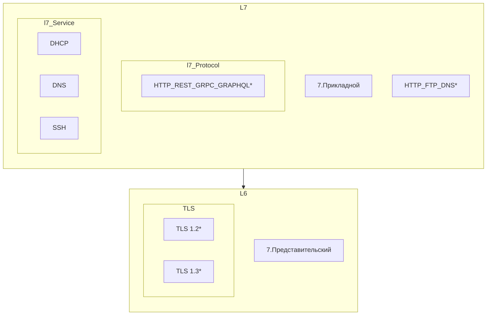
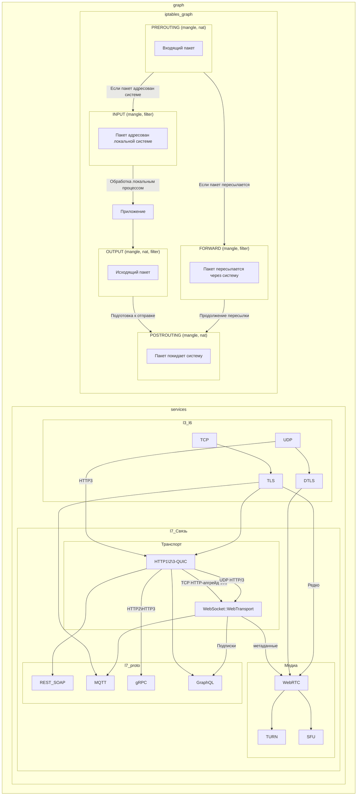
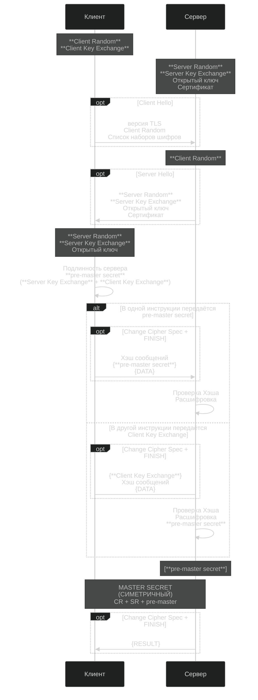

### Схема

[Оглавление](../README.md#оглавление)



### HTTP_FTP_DNS 
[Начало](./README.md#схема) [Оглавление](../README.md#оглавление)

```



```

!INCLUDE 

[SNIPPET](../../__01_base__/_02_net_/Теория/web.md?anchor=web_protocol)

```@eval
using Markdown
Markdown.parse_file(joinpath("..", "src", "../../linux/net/Теория/web.md"))
```

#include "../../linux/net/Теория/web.md"


### TLS 1.2

[Начало](./README.md#схема) [Оглавление](../README.md#оглавление)


### TLS 1.3

[Начало](./README.md#схема) [Оглавление](../README.md#оглавление)