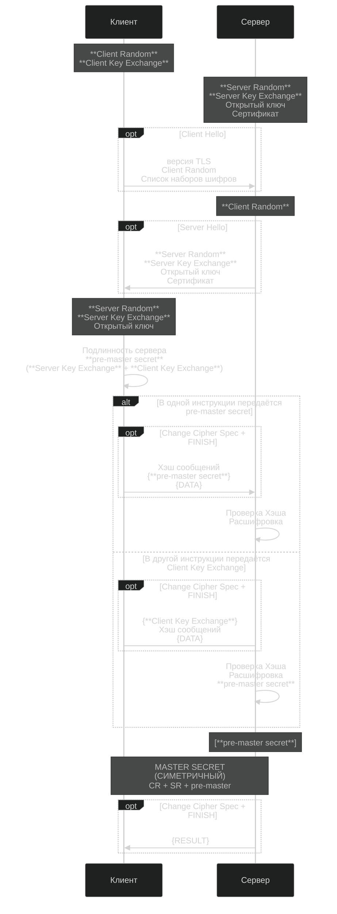
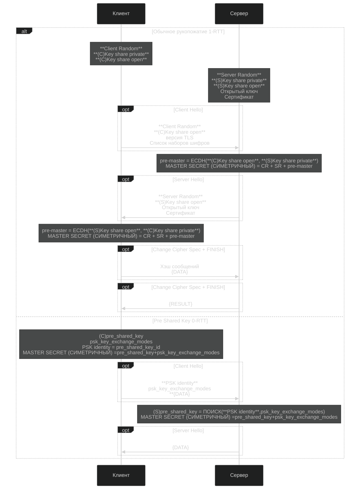

[TLS 1.3](#TLS-13)

[Оглавление](../../../__00_Собес__/README.md#оглавление) _____ [Схема](../../../__00_Собес__/01_Сеть/README.md#схема)

## TLS 1.2



## TLS 1.3
[TLS 1.2](#TLS-12)  
[Оглавление](../../../__00_Собес__/README.md#оглавление) _____ [Схема](../../../__00_Собес__/01_Сеть/README.md#схема)



```
       Client                                           Server
Key  ^ ClientHello
Exch | + key_share*
     | + signature_algorithms*
     | + psk_key_exchange_modes*
     v + pre_shared_key*       -------->
                                                  ServerHello  ^ Key
                                                 + key_share*  | Exch
                                            + pre_shared_key*  v
                                        {EncryptedExtensions}  ^  Server
                                        {CertificateRequest*}  v  Params
                                               {Certificate*}  ^
                                         {CertificateVerify*}  | Auth
                                                   {Finished}  v
                               <--------  [Application Data*]
     ^ {Certificate*}
Auth | {CertificateVerify*}
     v {Finished}              -------->
       [Application Data]      <------->  [Application Data]
```

# TLS 1.3 Handshake Diagram

[Оглавление](../../../__00_Собес__/README.md#оглавление) _____ [Схема](../../../__00_Собес__/01_Сеть/README.md#схема)

## 1. ClientHello (Клиент → Сервер)
```
Клиент → Сервер:
  - supported_versions = [TLS 1.3]
  - random_client = <32 байта>
  - cipher_suites = [AES-GCM, ChaCha20]
  - key_share = { (G * client_private_key) }
```

## 2. ServerHello (Сервер → Клиент)
```
Сервер → Клиент:
  - selected_version = TLS 1.3
  - random_server = <32 байта>
  - selected_cipher_suite
  - key_share = { (G * server_private_key) }
```

## 3. Вычисление общего секрета (ECDHE)

Общий секрет вычисляется как:
```math
shared_secret = (server_private_key * client_public_key) = (client_private_key * server_public_key)
```

## 4. Генерация ключей (HKDF)

1. **HKDF-Extract**:
   ```
   early_secret = HKDF-Extract(0, shared_secret)
   handshake_secret = HKDF-Extract(early_secret, shared_secret)
   ```
2. **HKDF-Expand**:
   ```
   master_secret = HKDF-Expand(handshake_secret, "derived")
   ````

## 5. Аутентификация (Сервер → Клиент)
```
Сервер → Клиент:
  - Сертификат (Certificate)
  - Подпись (signature = sign(private_key, handshake_transcript))
```

## 6. Завершение Handshake
```
Клиент и сервер отправляют Finished message:
  - verify_data = HMAC(finished_key, handshake_transcript)
  - Теперь данные передаются в зашифрованном виде.
```