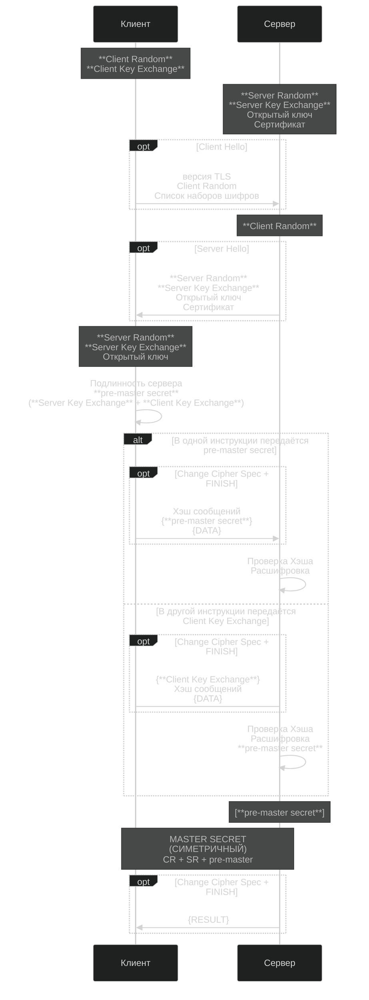
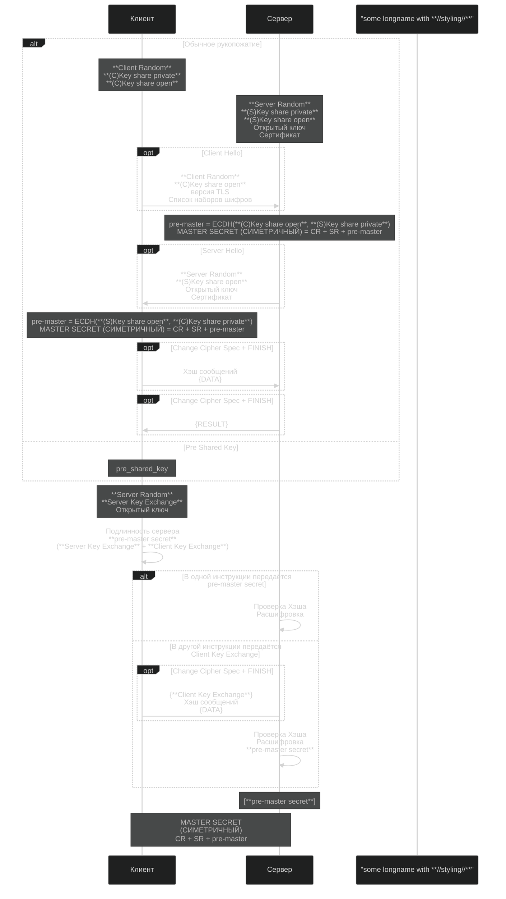

Полный жизненный цикл HTTPS-запроса через уровни OSI

Итоговая последовательность
DNS-запрос (если IP не в кеше).

ARP-запрос (если MAC шлюза неизвестен).

TCP 3-way handshake (SYN → SYN-ACK → ACK).
Вы звоните другу (SYN).
Друг поднимает трубку и говорит "Алло!" (SYN-ACK).
Вы отвечаете "Привет!" (ACK) → соединение установлено.


TLS handshake (аутентификация + шифрование).
TLS 1.2 
* Client Random (случайное число от клиента, отправлено в Client Hello). 
* Server Random (случайное число от сервера, отправлено в Server Hello). 
* Pre-Master Secret (временный ключ, созданный клиентом отправляется на сервер, зашифрованный публичным ключём).
  * Расшифровать можно только приватным ключём сервера.
* Сервер вычисляет Master Secret 
  * Pre-Master Secret + Client Random + Server Random обрабатываются с помощью функции PRF (Pseudo-Random Function).
* Server Finished (сообщение зашифровано Master Secret)
* Client Finished (сообщение зашифровано Master Secret)

  



```
Клиент                                      Сервер
  |                                            |
  | --- Client Hello (Client Random) --------> |
  | <-- Server Hello (Server Random) --------- |
  | <-- Certificate (Публичный ключ сервера) - |
  | -- Вычисляет (Pre-Master Secret)           |
  | -- Encrypted Pre-Master Secret (RSA) ----> |
  |          (зашифровано публичным ключом)    |
  |               Вычисляет (Master Secret) -- |
  | <-- Server Finished ---------------------- |
  | -- Вычисляет (Master Secret)               | 
  | --- Client Finished ---------------------> |
  |                                            |
  | === Зашифрованный трафик (AES-256) ======> |
```
TLS 1.3




```
       Client                                           Server

Key  ^ ClientHello
Exch | + key_share*
     | + signature_algorithms*
     | + psk_key_exchange_modes*
     v + pre_shared_key*       -------->
                                                  ServerHello  ^ Key
                                                 + key_share*  | Exch
                                            + pre_shared_key*  v
                                        {EncryptedExtensions}  ^  Server
                                        {CertificateRequest*}  v  Params
                                               {Certificate*}  ^
                                         {CertificateVerify*}  | Auth
                                                   {Finished}  v
                               <--------  [Application Data*]
     ^ {Certificate*}
Auth | {CertificateVerify*}
     v {Finished}              -------->
       [Application Data]      <------->  [Application Data]
```

# TLS 1.3 Handshake Diagram

## 1. ClientHello (Клиент → Сервер)
```
Клиент → Сервер:
  - supported_versions = [TLS 1.3]
  - random_client = <32 байта>
  - cipher_suites = [AES-GCM, ChaCha20]
  - key_share = { (G * client_private_key) }
```

## 2. ServerHello (Сервер → Клиент)
```
Сервер → Клиент:
  - selected_version = TLS 1.3
  - random_server = <32 байта>
  - selected_cipher_suite
  - key_share = { (G * server_private_key) }
```

## 3. Вычисление общего секрета (ECDHE)

Общий секрет вычисляется как:
```math
shared_secret = (server_private_key * client_public_key) = (client_private_key * server_public_key)
```

## 4. Генерация ключей (HKDF)

1. **HKDF-Extract**:
   ```
   early_secret = HKDF-Extract(0, shared_secret)
   handshake_secret = HKDF-Extract(early_secret, shared_secret)
   ```
2. **HKDF-Expand**:
   ```
   master_secret = HKDF-Expand(handshake_secret, "derived")
   ````

## 5. Аутентификация (Сервер → Клиент)
```
Сервер → Клиент:
  - Сертификат (Certificate)
  - Подпись (signature = sign(private_key, handshake_transcript))
```

## 6. Завершение Handshake
```
Клиент и сервер отправляют Finished message:
  - verify_data = HMAC(finished_key, handshake_transcript)
  - Теперь данные передаются в зашифрованном виде.
```

HTTPS-запрос/ответ (зашифрованные HTTP-данные).

Закрытие TCP-сессии (FIN → ACK → FIN → ACK).
После разговора вы оба говорите "Пока!" (FIN/FIN-ACK) → сессия закрыта.