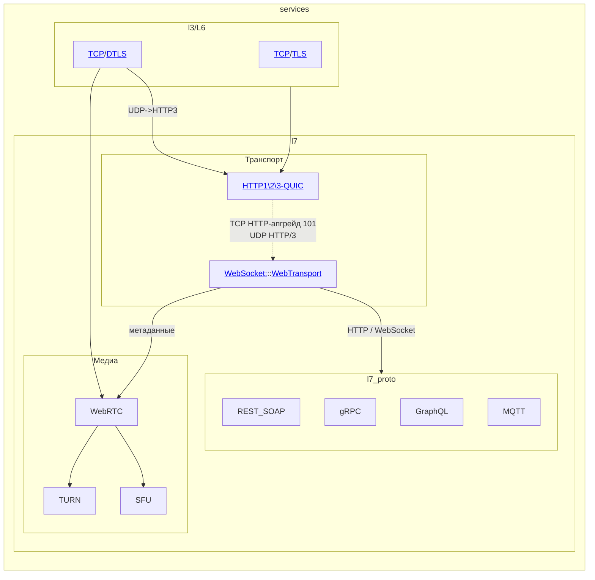

# Схема
[Оглавление](../../../__00_Собес__/README.md#оглавление) => [Сеть](../../../__00_Собес__/01_Сеть/README.md#схема)
<!-- ANCHOR: web_protocol -->

<!-- END_ANCHOR: web_protocol -->

## Сравнение http

[Оглавление](../../../__00_Собес__/README.md#оглавление) => [Сеть](../../../__00_Собес__/01_Сеть/README.md#схема) => [Protocols](./Protocols.md#схема)

| Характеристика          | HTTP/1.1                       | HTTP/2                   | HTTP/3 (QUIC)       |
|-------------------------|--------------------------------|--------------------------|---------------------|
| **Транспорт**           | TCP                            | TCP                      | UDP                 |
| **Мультиплексирование** | ❌ (нужны несколько соединений) | ✅ (в одном соединении)   | ✅ (лучше из-за UDP) |
| **Сжатие заголовков**   | ❌                              | ✅ (HPACK)                | ✅ (QPACK)           |
| **Приоритизация**       | ❌                              | ✅                        | ✅                   |
| **Server Push**         | ❌                              | ✅                        | ✅                   |
| **Шифрование**          | Только с HTTPS                 | Только с HTTPS           | Встроено в QUIC     |
| **Задержки**            | Высокие (TCP + HOL)            | Лучше, но есть HOL в TCP | Минимальные (UDP)   |

## WebSocket

[Оглавление](../../../__00_Собес__/README.md#оглавление) => [Сеть](../../../__00_Собес__/01_Сеть/README.md#схема) => [Protocols](./Protocols.md#схема)

Обеспечивает полнодуплексную (двустороннюю) коммуникацию между клиентом и сервером через единственное TCP-соединение.
* HTTP --> Connection: Upgrade
* Постоянное соединение:
  * Text
  * Binary
  * Ping/Pong: для проверки соединения

## WebTransport

[Оглавление](../../../__00_Собес__/README.md#оглавление) => [Сеть](../../../__00_Собес__/01_Сеть/README.md#схема) => [Protocols](./Protocols.md#схема)

Замена WebSocket
* Множественные потоки
* Выбор режимов: 
  * надежный(как TCP); 
  * ненадежный(как UDP)

# Интерфейсы
## REST API
* Набор конечных точек
* Передача - запрос\ответ
* Использует HTTP методы для взаимодействия [GET,POST,PUT,PATCH,DELETE]
* Возвращает HTTP состояния [200,300,400,500]
* Аутентификация и авторизация:
  * Basic Auth
  * API Keys
  * OAuth/OAuth2
  * JWT 
## gRPC
Удалённый вызов процедур. 
* Данные передаются в бинарном виде (серилизация)
* Потоковая передача - встроенная в HTTP/2/3.
* Пример (для общего понимания):
  1) Создать .proto файл с методом (service). Это будет интерфейс.
  2) Собрать класс на нужном языке (python).
     * **ВАЖНО** - Классы должны быть общие для клиента и сервера!
  3) Запустить grpc сервер в коде и привязать собранный класс.
  4) Подключиться к серверу и вызвать класс.
## GraphQL
Интерфейс запросов (похож на SQL)
* Данные передаются в json.
* Потоковая передача WebSocket:
  * Для подписок - получение изменений в реальном времени.
* Возвращает HTTP состояния [200,300,400,500]
* Пример (для общего понимания):
  * На сервере:
    * Описать классы - объекты с переменными; предметы обмена.
    * Описать запросы(GET) - методы заполнения объектов.
    * Описать мутации(POST/PUT/DELETE) - Методы обновления базы.
    * Создать подписки - обратный вызов на клиенте при изменении на сервере.
  * На клиенте:
    * Описать запросы как строки. Это как отражение функции сервера.
    * Отправить запрос. (Опционально) И переменные в json.
    * Получить json в ответ.
    * Создать подписку.
## MQTT
Передача небольших сообщений в формате подписки.
* Работает поверх TCP.
* Данные передаются в бинарном виде (серилизация)
* Потоковая передача WebSocket:
  * Для подписки браузеров.
* Безопасность
  * TLS и acl(login\pass) на уровне сервера, без HTTP.
* Пример (для общего понимания):
  * На сервере:
    * Просто поднимаем сервер. он не следит за структурой топиков по умолчанию.
  * На клиенте (Publisher)
    * Подключиться к брокеру.
    * Сгенерировать json в свободном формате и отправить в топик (aaa/bbb/ccc)
    * Можно добавить метку времени в json.
  * На клиенте (Subscriber)
    * Подключаемся к брокеру.
    * В отдельном потоке читаем топик в бесконечном цикле.

# Медиа
## WebRTC
Передача аудио\видео потоков.
* Работает из браузера (node.js).
* Доступ к вэбке.
* Настройка связи через Сервер сигналинга (WebSocket)
* Варианты соединений:
  * Прямая связь P2P.
  * TURN-сервер - через сервер.
  * SFU-сервер - групповые звонки.

