```mermaid
%%{init: {'theme': 'dark', 'themeVariables': { 
    'background': '#1e1e2e',
    'primaryBorderColor': '#cdd6f4',
    'primaryTextColor': '#cdd6f4',
    'nodeBorder': '#585b70',
    'clusterBkg': '#313244',
    'clusterBorder': '#6c7086',
    'edgeLabelBackground': '#313244'
}}}%%
flowchart TD
subgraph Диск["▼ Диск (Storage)"]
direction TB
FS[["Файловая система
        (ext4/XFS)"]]
SW[["Swap
(раздел/файл)"]]
end

subgraph RAM["▼ Физическая память (RAM)"]
direction TB
PC[["Page Cache
(кэш файлов)
■ Clean pages"]]
DP[["Dirty Pages
■ Изменённые данные"]]
ANON[["Анонимные страницы
■ heap/stack/mmap"]]
end

subgraph Виртуальная["▸ Виртуальная память процесса"]
direction LR
CODE[["Код (text)
▸ file-backed"]]
DATA[["Данные
▸ BSS/heap"]]
STACK[["Стек
▸ anonymous"]]
end

%% Связи
Виртуальная -->|Отображение| RAM
CODE -.-> PC
DATA -.-> ANON
STACK -.-> ANON
PC --> DP
DP -->|sync| FS
ANON -->|swapout| SW

%% Стили
style Диск fill:#181825,stroke:#7f849c
style RAM fill:#181825,stroke:#7f849c
style Виртуальная fill:#181825,stroke:#7f849c

style FS fill:#45475a,stroke:#89b4fa
style SW fill:#45475a,stroke:#f38ba8

style PC fill:#45475a,stroke:#89dceb
style DP fill:#45475a,stroke:#fab387
style ANON fill:#45475a,stroke:#cba6f7

style CODE fill:#313244,stroke:#a6e3a1
style DATA fill:#313244,stroke:#fab387
style STACK fill:#313244,stroke:#cba6f7

linkStyle 0 stroke:#6c7086,stroke-width:1px
linkStyle 1,2 stroke:#585b70,stroke-dasharray:3
linkStyle 3 stroke:#fab387
linkStyle 4 stroke:#89b4fa
linkStyle 5 stroke:#f38ba8
```

## Swap 
Mеханизм подкачки, который использует часть дискового пространства (файл подкачки или отдельный раздел) для расширения виртуальной памяти.
* Swap-раздел (/dev/sdXN) — выделенный раздел на диске (быстрее).
* Swap-файл (/swapfile) — обычный файл, используемый как swap (удобнее для изменения размера).
## Управление памятью
### SWAP
Swappiness — настройка агрессивности swap  
Параметр vm.swappiness (от 0 до 100) определяет, насколько активно ядро будет переносить страницы памяти в swap.
* swappiness=0 — ядро будет избегать swap, пока RAM не закончится полностью.
* swappiness=60 (значение по умолчанию) — умеренное использование swap.
* swappiness=100 — ядро будет активно свопировать страницы.
### Page Cache & Dirty Pages
#### Очистка кэша
```bash
# Освобождение Page Cache (без потери данных)
echo 1 > /proc/sys/vm/drop_caches
# Освобождение inodes и dentries (структуры файловых систем)
echo 2 > /proc/sys/vm/drop_caches
# Освобождение всего (Page Cache + inodes + dentries)
echo 3 > /proc/sys/vm/drop_caches
```
#### Настройки ядра
```bash
# Просмотр текущих настроек
cat /proc/sys/vm/dirty_*
```
* `dirty_background_ratio` (% ОЗУ) — при достижении этого порога ядро начинает асинхронную запись Dirty Pages на диск (в фоне).
* `dirty_ratio` (% ОЗУ) — при достижении этого порога процессы блокируются до синхронизации Dirty Pages.
* `dirty_expire_centisecs` (в сотых секунды) — время, после которого Dirty Pages считаются "устаревшими" и должны быть записаны.
* `dirty_writeback_centisecs` (в сотых секунды) — частота проверки Dirty Pages фоновым процессом pdflush/kworker.
```bash
sysctl -w vm.dirty_background_ratio=5
sysctl -w vm.dirty_ratio=10
sysctl -w vm.dirty_expire_centisecs=1000
sysctl -w vm.dirty_writeback_centisecs=100
sysctl -p
```

## Page Cache (кэш страниц)
Page Cache — это кэш файловых операций в памяти.
* Ускоряет чтение/запись файлов.
* Автоматически освобождается при нехватке памяти.
## Dirty Pages (грязные страницы)
Dirty pages — это страницы памяти, изменённые процессом, но ещё не записанные на диск.
* Хранятся в кэше (page cache).
* Записываются на диск ядром (через pdflush или fsync).
## Анонимные страницы (Anonymous Pages)
Анонимные страницы — это страницы памяти, не связанные с файлами (например, динамическая память malloc()).
* Не могут быть просто так выгружены на диск (только через swap).
* При нехватке памяти:
  * Если есть swap — уходят туда.
  * Если swap отключён — OOM Killer убивает процессы.