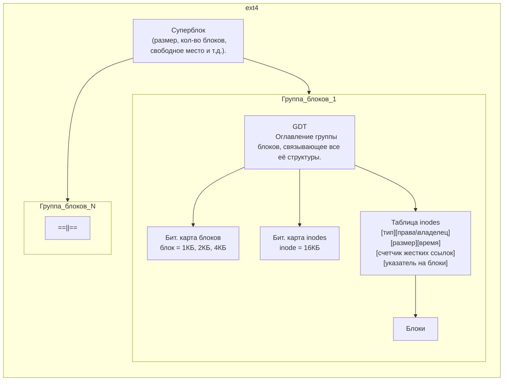

# Сравнение файловых систем Linux

| Характеристика                  | ext4               | XFS                       | Btrfs                  | NFS                | CIFS/SMB            | GlusterFS/CephFS     | ZFS                  |
|---------------------------------|--------------------|---------------------------|------------------------|--------------------|---------------------|----------------------|----------------------|
| **Тип ФС**                      | Локальная          | Локальная                 | Локальная + COW        | Сетевая            | Сетевая (Windows)   | Распределённая       | Локальная/сетевая    |
| **Макс. размер файла**          | 16 TiB (до 1 EiB*) | 8 EiB                     | 16 EiB                 | Зависит от сервера | 16 EiB (SMB3)       | Практически неогр.   | 16 EiB               |
| **Макс. размер раздела**        | 1 EiB              | 8 EiB                     | 16 EiB                 | —                  | —                   | Практически неогр.   | 256 ZiB              |
| **Журналирование**              | Да                 | Да                        | Да (CoW)               | Нет                | Нет                 | Зависит от бэкенда   | Да (CoW)             |
| **Снапшоты**                    | Нет                | Нет                       | Да                     | Нет                | Нет (если не VSS)   | Да                   | Да                   |
| **Сжатие**                      | Нет                | Нет                       | Да (zstd, lzo, zlib)   | Нет                | Нет                 | Да (Ceph)            | Да (LZ4, gzip, zstd) |
| **Дедупликация**                | Нет                | Нет                       | Да (очень медленно)    | Нет                | Нет                 | Да (Ceph)            | Да                   |
| **RAID**                        | Только через mdadm | Только через mdadm        | Встроенный (0,1,10)    | Нет                | Нет                 | Да (репликация)      | Встроенный (RAID-Z)  |
| **Оптимизация под SSD**         | Да (`discard`)     | Да                        | Да                     | Нет                | Нет                 | Нет                  | Да                   |
| **Кластерная поддержка**        | Нет                | Нет                       | Нет                    | Нет                | Да (SMB3)           | Да                   | Да (ZFS over Lustre) |
| **Надёжность**                  | Очень высокая      | Высокая                   | Средняя (молодая ФС)   | Зависит от сети    | Зависит от сети     | Высокая              | Очень высокая        |

**Примечания:**
- **CoW** (Copy-on-Write) – "копирование при записи (снапшоты)"
- **Журналирование** - предварительная запись изменений в журнал. 
  - **metadata journaling** - Записываются только структурные изменения (например, обновление inode, каталогов).
  - **full journaling** - Записываются и метаданные, и сами данные.
- **Дедупликация** - Объединение повторяющихся блоков данных.

## ext4
```
[ Суперблок ][ GDT ][ Бит. карта блоков ][ Бит. карта inodes ][ Таблица inodes ][ Блоки данных ]
```


## VFS
* Абстракция над другими fs
* Виртуальные директории в RAM пространства ядра:

  | Путь                            | Описание                                                                                                                                                                       |
  |---------------------------------|--------------------------------------------------------------------------------------------------------------------------------------------------------------------------------|
  | **`/proc`**                     | Динамическая информация о процессах (PID, статус, память) и параметрах ядра. Файлы генерируются ядром при чтении. Пример: `/proc/cpuinfo`, `/proc/1234/status`.                |
  | **`/sys`** (sysfs)              | Иерархия устройств, драйверов и настроек ядра. Используется для управления оборудованием (например, яркостью экрана или сетевыми интерфейсами). Пример: `/sys/class/net/eth0`. |
  | **`/dev`** (devtmpfs)           | Файлы устройств (диски, терминалы, виртуальные устройства). Создаётся динамически. Пример: `/dev/sda`, `/dev/null`.                                                            |
  | **`/run`** (tmpfs)              | Временные данные процессов (PID-файлы, сокеты), актуальные до перезагрузки. Заменяет `/var/run`. Пример: `/run/sshd.pid`.                                                      |
  | **`/tmp`** (tmpfs)              | Временные файлы приложений. По умолчанию очищается при перезагрузке. Может монтироваться в RAM. Пример: `/tmp/myapp_cache`.                                                    |
  | **`/dev/shm`** (tmpfs)          | Разделяемая память (POSIX Shared Memory) для межпроцессного взаимодействия (IPC). Размер обычно равен половине RAM.                                                            |
  | **`/sys/fs/cgroup`** (cgroupfs) | Управление ресурсами (CPU, память, I/O) для групп процессов (используется в контейнерах и systemd). Пример: `/sys/fs/cgroup/cpu`.                                              |

## RAID
* Создаётся утилитой mdadm (/etc/mdadm/mdadm.conf)

| Уровень | Минимум дисков | Описание                     | Отказоустойчивость | Плюсы                     | Минусы                     |
|---------|----------------|------------------------------|--------------------|---------------------------|----------------------------|
| **RAID 0**  | 2              | Чередование (stripe)         | Нет                | Макс. скорость            | Нет защиты                 |
| **RAID 1**  | 2              | Зеркало (mirror)             | 1 диск             | Надежность                | 50% объема                 |
| **RAID 5**  | 3              | Чередование + четность       | 1 диск             | Баланс скорости/надежности| Медленная запись           |
| **RAID 6**  | 4              | Двойная четность             | 2 диска            | Высокая надежность        | Очень медленная запись     |
| **RAID 10** | 4              | Зеркало + чередование (1+0)  | До 1 диска в паре  | Скорость + надежность     | 50% объема, дорого         |
