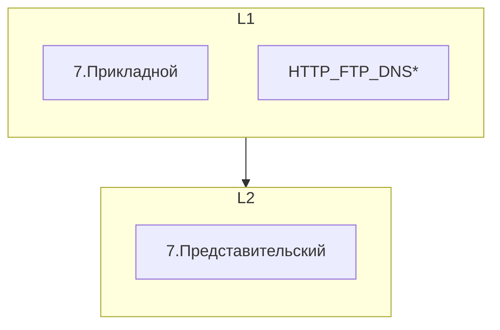
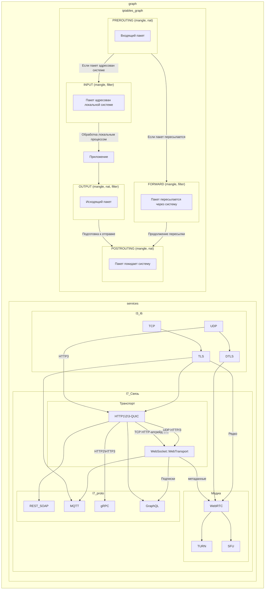

```mermaid
flowchart TB

    subgraph L1
        direction TB
        application["7.Прикладной"]
        HTTP_FTP_DNS["HTTP_FTP_DNS*"]
        click HTTP_FTP_DNS "#HTTP_FTP_DNS" "Перейти к разделу"
    end
    subgraph L2
        direction TB
        presentation["7.Представительский"]
        
    end


    L1 --> L2

```

###  HTTP_FTP_DNS

```mermaid
flowchart TB
subgraph graph
    direction LR

  
  subgraph services
  direction TB
  subgraph l3_l6
      TCP
      UDP
      TLS
      DTLS
  end
  subgraph l7_Связь
  direction TB
  subgraph Транспорт
  HTTP["HTTP1\2\3-QUIC"]
  WebSocket::WebTransport
  
  end
  subgraph Медиа
  WebRTC
  TURN
  SFU
  
  WebRTC --> TURN
  WebRTC --> SFU
  end
  
  subgraph l7_proto
  REST_SOAP
  gRPC
  GraphQL
  MQTT
  
  end
  HTTP --TCP HTTP-апгрейд 101--> WebSocket::WebTransport
  HTTP --UDP HTTP/3--> WebSocket::WebTransport
  WebSocket::WebTransport --метаданные--> WebRTC
  end
  
  TCP --> TLS
  UDP --> DTLS
  DTLS --> WebRTC
  TLS --Редко--> WebRTC
  TLS --> MQTT
  UDP --HTTP3--> HTTP
  TLS --> HTTP --> REST_SOAP
  HTTP --HTTP2\HTTP3--> gRPC
  HTTP --> GraphQL
  WebSocket::WebTransport --> MQTT
  WebSocket::WebTransport --Подписки--> GraphQL
  
  end
subgraph iptables_graph
direction TB
    subgraph PREROUTING ["PREROUTING (mangle, nat)"]
        A[Входящий пакет]
    end

    subgraph INPUT ["INPUT (mangle, filter)"]
        B[Пакет адресован локальной системе]
    end

    subgraph FORWARD ["FORWARD (mangle, filter)"]
        C[Пакет пересылается через систему]
    end

    subgraph OUTPUT ["OUTPUT (mangle, nat, filter)"]
        D[Исходящий пакет]
    end

    subgraph POSTROUTING ["POSTROUTING (mangle, nat)"]
        E[Пакет покидает систему]
    end
    PREROUTING -->|Если пакет адресован системе| INPUT
    PREROUTING -->|Если пакет пересылается| FORWARD
    INPUT -->|Обработка локальным процессом| G[Приложение]
    G --> OUTPUT
    OUTPUT -->|Подготовка к отправке| POSTROUTING
    FORWARD -->|Продолжение пересылки| POSTROUTING

  end
end

```
### Test