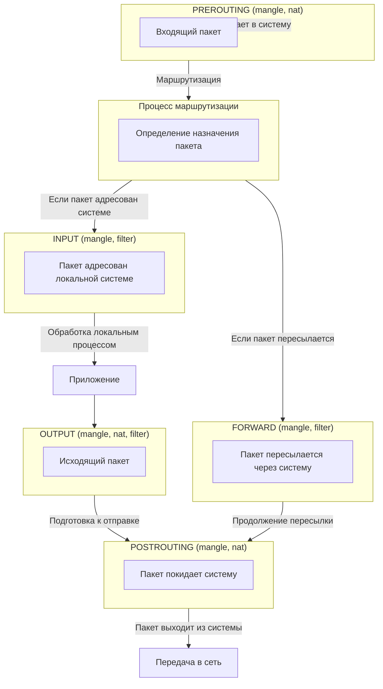

# Жизненный цикл пакета в iptables

Пакет проходит через несколько этапов при обработке `iptables`, и каждое правило может изменять его поведение. Ниже представлена схема с основными таблицами и цепочками.




# Концепция
## Цепочки
Это набор правил, которые обрабатывают пакеты в `iptables`. Пакеты проходят через цепочки, и для каждого пакета проверяются правила, пока не будет найдено соответствующее.

|  **Цепочки**    | **Назначение**                                       | **Описание**                                                                                                                                         | **Пример**                                                                                                                                                                                |
|------------------|------------------------------------------------------|--------------------------------------------------------------------------------------------------------------------------------------------------|--------------------------------------------------------------------------------------------------------------------------------------------------------------------------------------------|
| **INPUT**        | Пакеты, предназначенные для устройства.              | Цепочка, которая обрабатывает входящий трафик. Это стандартная цепочка для фильтрации пакетов, поступающих на устройство.                                 | Разрешение всех входящих подключений на порт 80 (HTTP):<br>```sudo iptables -A INPUT -p tcp --dport 80 -j ACCEPT```                                                                         |
| **OUTPUT**       | Пакеты, исходящие с устройства.                      | Цепочка для исходящего трафика. Обрабатывает пакеты, исходящие из устройства.                                                                          | Запрещение исходящих соединений на порт 25 (SMTP):<br>```sudo iptables -A OUTPUT -p tcp --dport 25 -j REJECT```                                                                            |
| **FORWARD**      | Пакеты, проходящие через устройство (маршрутизатор). |Цепочка для маршрутизации трафика между сетевыми интерфейсами. Она используется на устройствах, которые работают как маршрутизаторы.                     | Разрешение трафика для определённого IP, проходящего через маршрутизатор:<br>```sudo iptables -A FORWARD -p tcp -s 192.168.1.100 -j ACCEPT```                                                 |
| **PREROUTING**   | Действия до обработки                                | Цепочка, которая обрабатывает пакеты до того, как они попадут в процесс маршрутизации (в основном используется для NAT).                                   | Перенаправление трафика на определённый IP-адрес:<br>```sudo iptables -t nat -A PREROUTING -p tcp --dport 80 -j DNAT --to-destination 192.168.1.100:8080```                               |
| **POSTROUTING**  | Действия после обработки                             | Цепочка, которая обрабатывает пакеты после их маршрутизации (используется для изменений в исходящих пакетах, например, NAT).                              | Маскарадинг для исходящего трафика (например, на маршрутизаторе):<br>```sudo iptables -t nat -A POSTROUTING -o eth0 -j MASQUERADE```                                                          |

## Таблицы

Система группировки правил для разных типов обработки трафика. В `iptables` есть несколько таблиц, каждая из которых имеет свою цель.

| **Таблицы**      | **Цепочки**                                                                     | **Назначение**                              | **Описание**                                                                                                                                              | **Пример**                                                                                                                         |
|------------------|---------------------------------------------------------------------------------|---------------------------------------------|-----------------------------------------------------------------------------------------------------------------------------------------------------------|------------------------------------------------------------------------------------------------------------------------------------|
| **filter**       | **INPUT**<br/>**OUTPUT**<br/>**FORWARD**                                        | Основная таблица фильтрации.                | Основная таблица для фильтрации пакетов. Все цепочки по умолчанию принадлежат этой таблице.                                                               | Фильтрация пакетов: <br>```sudo iptables -A INPUT -p tcp --dport 80 -j ACCEPT```                                                   |
| **nat**          | **PREROUTING**<br/>**OUTPUT**<br/>**POSTROUTING**                               | Для преобразования адресов.                 | Таблица для работы с преобразованием адресов (NAT), которая используется для манипуляций с IP-адресами, например, для перенаправления портов.             | Перенаправление портов: <br>```sudo iptables -t nat -A PREROUTING -p tcp --dport 80 -j DNAT --to-destination 192.168.1.100:8080``` |
| **mangle**       | **PREROUTING**<br/>**INPUT**<br/>**OUTPUT**<br/>**FORWARD**<br/>**POSTROUTING** | Для изменения пакетов.                      | Таблица для изменения пакетов, например, для изменения TOS (Type of Service), TTL (Time to Live) или других параметров.                                   | Изменение поля TTL в пакетах:<br>```sudo iptables -t mangle -A POSTROUTING -j TTL --ttl-set 64```                                  |
| **raw**          | **PREROUTING**<br/>**OUTPUT**                                                   | Для обработки соединений до маршрутизации.  | Таблица, которая обрабатывает пакеты до того, как они попадут в процесс маршрутизации. Применяется для работы с соединениями, которые не затрагивают NAT. | Отключение отслеживания соединений (используется в специфичных ситуациях):<br>```sudo iptables -t raw -A PREROUTING -j NOTRACK```  |

## Действия (-j)

Это действия, которые выполняются для пакета, если он соответствует определенному правилу. Пример: разрешить, отклонить, записать лог и т.д.

| **Цели (targets)** | **Назначение**                                                             | Логирование пакета.                                                                                                                                 | **Пример**                                                                                             | 
|--------------------|----------------------------------------------------------------------------|-----------------------------------------------------------------------------------------------------------------------------------------------------|--------------------------------------------------------------------------------------------------------|
| **ACCEPT**         | Разрешить пакет.                                                           | Разрешает передачу пакета. Используется в правилах для явного разрешения трафика.                                                                   | ```sudo iptables -A INPUT -p tcp --dport 80 -j ACCEPT```                                               |
| **DROP**           | Отклонить пакет.                                                           | Отклоняет пакет без ответа. Это более безопасный способ блокировки, так как злоумышленник не получает никаких данных о заблокированном пакете.      | ```sudo iptables -A INPUT -p tcp --dport 80 -j DROP```                                                 |
| **REJECT**         | Отклонить пакет с отправкой сообщения об ошибке.                           | Отклоняет пакет, но посылает отправителю сообщение об ошибке. Обычно используется для фильтрации трафика с отправкой уведомления об отказе.         | ```sudo iptables -A INPUT -p tcp --dport 80 -j REJECT```                                               |
| **LOG**            | Логирование пакета.                                                        | Логирует пакет, записывая информацию о нём в системный журнал. Используется для мониторинга или диагностики.                                        | ```sudo iptables -A INPUT -p tcp --dport 80 -j LOG --log-prefix "HTTP_REQUEST: "```                    |
| **MASQUERADE**     | Подменить ip источника на динамический (нет статического внешнего ip).     | Применяется в NAT для динамической трансляции IP-адресов, например, для обеспечения выхода в интернет с локальной сети через один внешний IP-адрес. | ```sudo iptables -t nat -A POSTROUTING -o eth0 -j MASQUERADE```                                        |
| **SNAT**           | Подменить ip источника на статический внешний ip.                          | Используется для статической трансляции исходящего трафика, например, для изменения исходного адреса пакета на определённый.                        | ```sudo iptables -t nat -A POSTROUTING -s 192.168.1.100 -j SNAT --to 192.168.1.1```                    |
| **DNAT**           | Подменить ip:port назначения на заданный. (частный случай проброс портов). | Применяется для изменения назначения пакета (например, для перенаправления трафика на другой сервер).                                               | ```sudo iptables -t nat -A PREROUTING -p tcp --dport 80 -j DNAT --to-destination 192.168.1.100:8080``` |

## Связи цепочек, таблиц и действий в iptables

| **Действия (-j)**  | **Таблица (Table)**    | **Цепочка (Chain)**         | **Описание**                               |
|--------------------|------------------------|-----------------------------|--------------------------------------------|
| **ACCEPT**         | filter                 | INPUT, FORWARD, OUTPUT      | Разрешает пакет                            |
| **DROP**           | filter                 | INPUT, FORWARD, OUTPUT      | Отбрасывает пакет                          |
| **REJECT**         | filter                 | INPUT, FORWARD, OUTPUT      | Отклоняет пакет с уведомлением             |
| **LOG**            | filter, nat, mangle    | Любая                       | Логирует пакет в syslog                    |
| **SNAT**           | nat                    | POSTROUTING                 | Меняет источник пакета (Source NAT)        |
| **DNAT**           | nat                    | PREROUTING, OUTPUT          | Меняет адрес назначения (Destination NAT)  |
| **MASQUERADE**     | nat                    | POSTROUTING                 | Динамический SNAT                          |
| **REDIRECT**       | nat                    | PREROUTING, OUTPUT          | Перенаправляет трафик на локальную машину  |
| **MARK**           | mangle                 | PREROUTING, OUTPUT, FORWARD | Устанавливает метку пакета                 |
| **TTL**            | mangle                 | PREROUTING, OUTPUT, FORWARD | Меняет TTL пакета                          |
| **TOS**            | mangle                 | PREROUTING, OUTPUT, FORWARD | Меняет TOS (Type of Service)               |
| **NOTRACK**        | raw                    | PREROUTING, OUTPUT          | Отключает отслеживание соединений          |
| **CONNMARK**       | mangle                 | PREROUTING, OUTPUT, FORWARD | Устанавливает метку соединения             |
| **QUEUE**          | filter, nat, mangle    | Любая                       | Отправляет пакет в очередь пользователя    |
| **RETURN**         | Любая                  | Любая                       | Возвращает управление в предыдущую цепочку |

## 🔹 Основные команды (Commands)
| Ключ | Описание                                                 |
|------|----------------------------------------------------------|
| `-A` | Добавить правило в конец цепочки (`-A INPUT`)            |
| `-I` | Вставить правило в начало (или по номеру) (`-I INPUT 2`) |
| `-D` | Удалить правило по номеру или совпадению (`-D INPUT 3`)  |
| `-R` | Заменить правило (`-R INPUT 1 -s 192.168.1.1 -j DROP`)   |
| `-L` | Показать все правила (`-L -n -v` для подробного вывода)  |
| `-F` | Очистить цепочку (`-F INPUT`)                            |
| `-Z` | Сбросить счётчики пакетов/байт (`-Z INPUT`)              |
| `-N` | Создать новую пользовательскую цепочку (`-N MY_CHAIN`)   |
| `-X` | Удалить пустую пользовательскую цепочку (`-X MY_CHAIN`)  |
| `-P` | Установить политику по умолчанию (`-P INPUT DROP`)       |

## 🔹 Параметры правил (Rule Specifications)
| Ключ      | Описание                                                         |
|-----------|------------------------------------------------------------------|
| `-p`      | Протокол (`tcp`, `udp`, `icmp`, `all`)                           |
| `-s`      | Исходный IP/подсеть (`-s 192.168.1.0/24`)                        |
| `-d`      | Целевой IP/подсеть (`-d 10.0.0.1`)                               |
| `-i`      | Входящий интерфейс (`-i eth0`)                                   |
| `-o`      | Исходящий интерфейс (`-o eth1`)                                  |
| `-j`      | Действие (`ACCEPT`, `DROP`, `REJECT`, `LOG`, `DNAT`, `SNAT` ...) |
| `--sport` | Исходный порт (`--sport 22`)                                     |
| `--dport` | Целевой порт (`--dport 80`)                                      |
| `-m`      | Загрузить модуль (`-m state --state ESTABLISHED`)                |

## 🔹 Модули (Match Extensions)
| Модуль      | Описание                                                                | Пример использования                                   |
|-------------|-------------------------------------------------------------------------|--------------------------------------------------------|
| `state`     | Фильтрация по состоянию соединения (NEW, ESTABLISHED, RELATED, INVALID) | `-m state --state ESTABLISHED,RELATED`                 |
| `conntrack` | Аналог `state`, но с расширенными возможностями отслеживания соединений | `-m conntrack --ctstate INVALID -j DROP`               |
| `limit`     | Ограничение частоты срабатывания правил                                 | `-m limit --limit 5/sec --limit-burst 10`              |
| `multiport` | Фильтрация по нескольким портам                                         | `-m multiport --ports 22,80,443`                       |
| `iprange`   | Фильтрация по диапазону IP-адресов                                      | `-m iprange --src-range 192.168.1.1-192.168.1.100`     |
| `string`    | Поиск строк в пакетах (для блокировки по содержимому)                   | `-m string --string "blockme" --algo bm`               |
| `time`      | Фильтрация по времени (дни/часы)                                        | `-m time --timestart 09:00 --timestop 18:00`           |
| `connlimit` | Ограничение количества соединений с одного IP                           | `-m connlimit --connlimit-above 50 -j DROP`            |
| `hashlimit` | Улучшенная версия `limit` с учётом IP/портов                            | `-m hashlimit --hashlimit 10/sec --hashlimit-burst 20` |
| `mac`       | Фильтрация по MAC-адресу                                                | `-m mac --mac-source 00:1A:2B:3C:4D:5E`                |
| `owner`     | Фильтрация по UID/GID процесса (только для OUTPUT)                      | `-m owner --uid-owner 1000`                            |
| `tos`       | Фильтрация по типу сервиса (Type of Service)                            | `-m tos --tos Minimize-Delay`                          |
| `length`    | Фильтрация по длине пакета                                              | `-m length --length 100:200`                           |
| `recent`    | Динамическое добавление IP в чёрный список                              | `-m recent --name ATTACKERS --set`                     |
| `set`       | Работа с IP/порт-наборами (ipset)                                       | `-m set --match-set blacklist src`                     |
| `geoip`     | Фильтрация по стране (требует отдельной установки)                      | `-m geoip --src-cc RU,CN`                              |
| `comment`   | Добавление комментария к правилу                                        | `-m comment --comment "Block SSH brute-force"`         |

## Основные состояния (--state)

| Состояние   | 	Описание                                                              | 	Пример использования                   |
|-------------|------------------------------------------------------------------------|-----------------------------------------|
| NEW         | 	Новое соединение (первый пакет, например, SYN в TCP).                 | 	-m state --state NEW -j ACCEPT         |
| ESTABLISHED | 	Уже установленное соединение (пакеты в рамках существующей сессии).   | 	-m state --state ESTABLISHED -j ACCEPT |
| RELATED     | 	Связанное соединение (например, FTP-пассивный режим или ICMP-ошибки). | 	-m state --state RELATED -j ACCEPT     |
| INVALID     | 	Невалидные пакеты (например, с битым заголовком).                     | 	-m state --state INVALID -j DROP       |
#### Принцип работы.
```shell
# 1. Разрешаем NEW только для SSH (порт 22)
iptables -A INPUT -p tcp --dport 22 -j ACCEPT
# 2. Разрешаем ответы на ЛЮБЫЕ запросы сервера (ESTABLISHED/RELATED)
iptables -A INPUT -m conntrack --ctstate ESTABLISHED,RELATED -j ACCEPT
# 3. Всё остальное блокируем
iptables -P INPUT DROP
```


# Примеры использования
## Блокировка всех входящих соединений, кроме заданных
```shell
# Установить политику по умолчанию (DROP для входящих)
iptables -P INPUT DROP
# Разрешить SSH (22 порт)
iptables -A INPUT -p tcp --dport 22 -j ACCEPT
# Разрешить HTTP (80) и HTTPS (443)
iptables -A INPUT -p tcp --dport 80 -j ACCEPT
iptables -A INPUT -p tcp --dport 443 -j ACCEPT
# Разрешить только локальные подключения
iptables -A INPUT -p tcp --dport 3306 -s 127.0.0.1 -j ACCEPT
# Запретить все остальные
iptables -A INPUT -p tcp --dport 3306 -j DROP
# Разрешить ответы на исходящие запросы (ESTABLISHED)
iptables -A INPUT -m state --state ESTABLISHED,RELATED -j ACCEPT
```
## Запрет исходящего трафика
```shell
# Блокировка HTTP/HTTPS для IP 192.168.1.100
iptables -A OUTPUT -d 192.168.1.100 -p tcp --dport 80 -j DROP
iptables -A OUTPUT -d 192.168.1.100 -p tcp --dport 443 -j DROP
# Блокировка отправки почты (SMTP)
iptables -A OUTPUT -p tcp --dport 25 -j DROP
```
## Блокировка ICMP (ping)
```shell
# Запретить входящие ping-запросы
iptables -A INPUT -p icmp --icmp-type echo-request -j DROP
```
## Проброс порта (Port Forwarding)
```shell
# Перенаправить порт 8080 на внутренний сервер 192.168.1.10:80
iptables -t nat -A PREROUTING -p tcp --dport 8080 -j DNAT --to-destination 192.168.1.10:80
iptables -A FORWARD -p tcp -d 192.168.1.10 --dport 80 -j ACCEPT
```
## NAT для локальной сети (раздача интернета)
```shell
# Включить форвардинг
echo 1 > /proc/sys/net/ipv4/ip_forward
# Разрешить MASQUERADE (NAT)
iptables -t nat -A POSTROUTING -o eth0 -j MASQUERADE
# Разрешить форвардинг между интерфейсами
iptables -A FORWARD -i eth1 -o eth0 -j ACCEPT
iptables -A FORWARD -i eth0 -o eth1 -m state --state ESTABLISHED,RELATED -j ACCEPT
```
## Логирование пакетов
```shell
# Логировать все входящие подключения на порт 80
iptables -A INPUT -p tcp --dport 80 -m limit --limit 5/min -j LOG --log-prefix "HTTP Traffic: "

```


