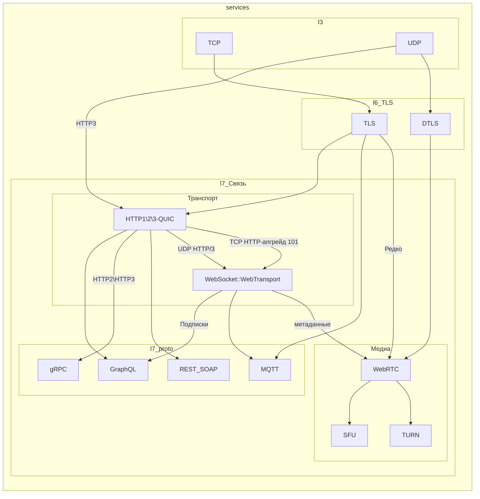

# Коды
| Код состояния                  | Описание                                                      |
|--------------------------------|---------------------------------------------------------------|
| **1xx: Информационные ответы** |                                                               |
| 100                            | Сервер ожидает оставшуюся часть запроса.                      |
| 101                            | Сервер согласен сменить протокол (например, на WebSocket).    |
| 102                            | Сервер обрабатывает запрос, но ответ ещё не готов.            |
| **2xx: Успешные ответы**       |
| 200                            | Успешный запрос (например, `curl -I https://example.com`).    |
| 201                            | Ресурс успешно создан (POST-запрос).                          |
| 202                            | Запрос принят, но ещё не обработан.                           |
| 204                            | Успешный запрос, но тело ответа пусто (DELETE-запрос).        |
| 206                            | Сервер отправил часть данных (используется в докачке файлов). |
| **3xx: Перенаправления**       |
| 301                            | Ресурс перемещён навсегда (редирект на новый URL).            |
| 302                            | Временный редирект.                                           |
| 304                            | Контент не изменился (кеширование).                           |
| 307                            | Временный редирект с сохранением метода запроса.              |
| 308                            | Постоянный редирект с сохранением метода запроса.             |
| **4xx: Ошибки клиента**        |
| 400                            | Неправильный синтаксис запроса (например, неверный JSON).     |
| 401                            | Требуется аутентификация (например, `curl -u user:pass URL`). |
| 403                            | Доступ запрещён (нет прав).                                   |
| 404                            | Ресурс не найден (`curl https://example.com/nonexistent`).    |
| 405                            | Метод не поддерживается (например, POST вместо GET).          |
| 408                            | Сервер ожидал запрос слишком долго.                           |
| 429                            | Превышен лимит запросов (DDoS-защита).                        |
| **5xx: Ошибки сервера**        |
| 500                            | Ошибка на стороне сервера (например, сбой в коде).            |
| 502                            | Проблема с прокси-сервером или upstream.                      |
| 503                            | Сервер временно недоступен (перегрузка/техработы).            |
| 504                            | Прокси-сервер не дождался ответа от upstream.                 |
| 507                            | Не хватает места на сервере.                                  |
| 508                            | Обнаружено бесконечное перенаправление.                       |

# Схема 

# Транспорт
## WebSocket
Обеспечивает полнодуплексную (двустороннюю) коммуникацию между клиентом и сервером через единственное TCP-соединение.
* HTTP --> Connection: Upgrade
* Постоянное соединение:
  * Text
  * Binary
  * Ping/Pong: для проверки соединения
## WebTransport
Замена WebSocket
* Множественные потоки
* Выбор режимов: 
  * надежный(как TCP); 
  * ненадежный(как UDP)

# Интерфейсы
## REST API
* Набор конечных точек
* Передача - запрос\ответ
* Использует HTTP методы для взаимодействия [GET,POST,PUT,PATCH,DELETE]
* Возвращает HTTP состояния [200,300,400,500]
* Аутентификация и авторизация:
  * Basic Auth
  * API Keys
  * OAuth/OAuth2
  * JWT 
## gRPC
Удалённый вызов процедур. 
* Данные передаются в бинарном виде (серилизация)
* Потоковая передача - встроенная в HTTP/2/3.
* Пример (для общего понимания):
  1) Создать .proto файл с методом (service). Это будет интерфейс.
  2) Собрать класс на нужном языке (python).
     * **ВАЖНО** - Классы должны быть общие для клиента и сервера!
  3) Запустить grpc сервер в коде и привязать собранный класс.
  4) Подключиться к серверу и вызвать класс.
## GraphQL
Интерфейс запросов (похож на SQL)
* Данные передаются в json.
* Потоковая передача WebSocket:
  * Для подписок - получение изменений в реальном времени.
* Возвращает HTTP состояния [200,300,400,500]
* Пример (для общего понимания):
  * На сервере:
    * Описать классы - объекты с переменными; предметы обмена.
    * Описать запросы(GET) - методы заполнения объектов.
    * Описать мутации(POST/PUT/DELETE) - Методы обновления базы.
    * Создать подписки - обратный вызов на клиенте при изменении на сервере.
  * На клиенте:
    * Описать запросы как строки. Это как отражение функции сервера.
    * Отправить запрос. (Опционально) И переменные в json.
    * Получить json в ответ.
    * Создать подписку.
## MQTT
Передача небольших сообщений в формате подписки.
* Работает поверх TCP.
* Данные передаются в бинарном виде (серилизация)
* Потоковая передача WebSocket:
  * Для подписки браузеров.
* Безопасность
  * TLS и acl(login\pass) на уровне сервера, без HTTP.
* Пример (для общего понимания):
  * На сервере:
    * Просто поднимаем сервер. он не следит за структурой топиков по умолчанию.
  * На клиенте (Publisher)
    * Подключиться к брокеру.
    * Сгенерировать json в свободном формате и отправить в топик (aaa/bbb/ccc)
    * Можно добавить метку времени в json.
  * На клиенте (Subscriber)
    * Подключаемся к брокеру.
    * В отдельном потоке читаем топик в бесконечном цикле.

# Медиа
## WebRTC
Передача аудио\видео потоков.
* Работает из браузера (node.js).
* Доступ к вэбке.
* Настройка связи через Сервер сигналинга (WebSocket)
* Варианты соединений:
  * Прямая связь P2P.
  * TURN-сервер - через сервер.
  * SFU-сервер - групповые звонки.

