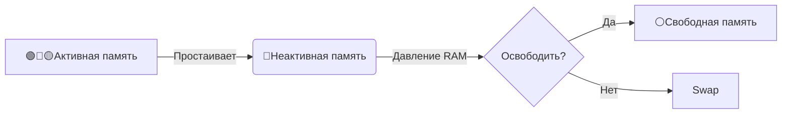

# HTOP

## Общее
Данные системы берутся из:  
* `/proc/pressure/[cpu/io/memory]`
* `/proc/loadavg`
## Load Average (экспоненциально взвешенное скользящее среднее)
Отражает:
* количество процессов, которые используют CPU
* Ожидают в очереди выполнения
* Ожидают завершения операций ввода-вывода (I/O).  

Для 4-х ядер:
* `< 4.0` – система справляется, процессор не перегружен.
* `= 4.0` – CPU загружен на 100%, но без очереди.
* `> 4.0` – есть процессы в очереди, возможны тормоза.

### 🔹 Базовая формула расчёта Load Average

**Формула Load Average:**
`Load(t) = Load(t-1) * e^(-α) + n * (1 - e^(-α))`

Где:
- `Load(t)` — текущее значение нагрузки,
- `Load(t-1)` — предыдущее значение,
- `n` — текущее количество активных процессов (R + D),
- `α` — коэффициент затухания,
- `e` — основание натурального логарифма (~2.71828).

---

### 🔹 Таблица коэффициентов затухания (α)

| Интервал  | Коэффициент (α)                     | Пояснение                          |
|-----------|-------------------------------------|------------------------------------|
| **1 мин** | $$\alpha_{1min} = \frac{1}{60} \\$$ | Быстрее реагирует на изменения     |
| **5 мин** | $$\alpha_{5min} = \frac{1}{300} \\$$                | Более плавное усреднение           |
| **15 мин**| $$\alpha_{15min} = \frac{1}{900} $$               | Максимально сглаженный тренд       |

Примечание:
- Чем **меньше** α, тем сильнее влияние новых данных.
- Для 1-минутного LA: $$e^{-1/60} \approx 0.983 \quad \text{(для 1-минутного интервала)}$$, то есть новые данные добавляют ~1.7% к общему значению.

## RAM
### 🔹 Сравнение PSI (Pressure Stall Information) "some memory" и PSI "full memory" в htop

| Параметр               | PSI "some memory"                          | PSI "full memory"                          |
|------------------------|-------------------------------------------|-------------------------------------------|
| **Что измеряет**       | Частичную нехватку памяти                 | Полную нехватку памяти                    |
| **Уровень критичности**| Предупреждение                            | Аварийная ситуация                        |
| **Порог для тревоги**  | >10%                                      | >1%                                       |
| **Типичные значения в норме** | 0-5%                                | 0%                                        |
| **Влияние на систему** | Отдельные процессы замедляются            | Системные зависания, срабатывание OOM-Killer |
| **Аналог**            | Пробки на отдельных полосах движения      | Полный коллапс транспортной системы       |
| **Рекомендуемые действия** | Оптимизировать память, закрыть ненужные процессы | Срочно освобождать память, анализировать `dmesg` |

### 🎨 Цветовая схема полоски памяти (Mem) в htop

| Цвет       | Компонент памяти          | Описание                                                                 | Когда увеличивается?                     |
|------------|---------------------------|-------------------------------------------------------------------------|------------------------------------------|
| **🟢 Зелёный** | Используемая память       | Память, занятая приложениями и процессами                               | При запуске программ, загрузке данных    |
| **🔵 Синий**   | Буферы (Buffers)          | Временное хранилище для данных, готовых к записи на диск/сеть           | При активных файловых операциях          |
| **🟡 Жёлтый**  | Кеш (Cached)              | Кешированные данные файлов (можно мгновенно освободить)                 | При частом чтении файлов                 |
| **🔴 Красный** | Неактивная память         | Память, выделенная, но не используемая процессами (потенциально свободная)| При неэффективном распределении памяти  |
| **⚪ Серый**   | Свободная память          | Полностью неиспользуемая память                                         | -                                        |

### 🔍 Ключевые особенности:
1. **Оптимизация Linux**: Синий/жёлтый сегменты ≠ проблема — это нормальная работа ОС по ускорению доступа к данным.
2. **Тревожные сигналы**:
  - 🔴 Красный >10% → Проверьте `sudo smem -s pss -k`
  - 🟢 Зелёный >90% → Риск исчерпания памяти

### Полная расшифровка колонок памяти в htop

| Колонка | Название          | Описание                                                                 | Важные нюансы                                                                 |
|---------|-------------------|-------------------------------------------------------------------------|-------------------------------------------------------------------------------|
| **VIRT**  | Virtual Memory    | Вся память, запрошенная процессом (RAM + swap + mmap'ы + библиотеки). Включает даже неиспользуемую память. | • Может быть больше физической RAM • Не означает реального потребления      |
| **RES**   | Resident Memory   | Фактическая RAM, используемая процессом (включая shared-память). Измеряется в кибибайтах (KiB). | • Главный показатель "прожорливости" • Влияет на OOM-Killer                |
| **SHR**   | Shared Memory     | Общая память, используемая с другими процессами (библиотеки, shared mem). | • Экономит RAM (например, 10 процессов с libc → SHR учитывается 1 раз в RES)  |
| **MEM%**  | Memory Percentage | Доля RES от общей физической RAM. Формула: `(RES / total_RAM) * 100%`. | • Показывает реальное влияние на систему                                      |

## IO

### Основные отличия PSI "some IO" и PSI "full IO" в htop

| Критерий          | PSI "some IO"                              | PSI "full IO"                              |
|-------------------|-------------------------------------------|-------------------------------------------|
| **Уровень воздействия** | Отдельные процессы испытывают задержки    | Вся система простаивает из-за IO          |
| **Критичность**    | Ранний индикатор проблем                  | Аварийная ситуация                        |
| **Порог тревоги**  | >5-10% (avg10)                            | >1% (avg10)                               |
| **Цвет в htop**    | Жёлтый/оранжевый                          | Красный                                   |
| **Типичные причины** | • Очередь диска • Медленный SSD/HDD   | • Полная перегрузка диска • Блокировка NFS |
| **Где смотреть**   | `cat /proc/pressure/io \| grep some`      | `cat /proc/pressure/io \| grep full`      |
| **Оптимизация**    | Настройка очереди запросов (nr_requests)  | Апгрейд диска/использование RAID          |

# TOP
| Параметр                      | Описание                                                                                                                                                                                                                                                 |
|:------------------------------|:---------------------------------------------------------------------------------------------------------------------------------------------------------------------------------------------------------------------------------------------------------|
| us (user)                     | Использование процессора пользовательским процессами                                                                                                                                                                                                     |
| sy (system)                   | Использование процессора системным процессами                                                                                                                                                                                                            |
| ni (nice)                     | Использование процессора процессами с измененным приоритетом с помощью команды nice                                                                                                                                                                      |
| id (idle)                     | Простой процессора. Можно сказать, что это свободные ресурсы                                                                                                                                                                                             |
| wa (IO-wait)                  | Время на простой, то есть ожидания переферийных устройств ввода вывода                                                                                                                                                                                   |
| hi (hardware interrupts)      | Показывает сколько процессорного времени было потрачено на обслуживание аппаратного прерывания. (Аппаратные прерывания генерируются аппаратными устройствами. Сетевыми картами, клавиуатурами, датчиками, когда им нужно о чем-то просигнализировать цп. |
| si (software interrupts)      | Показывает сколько процессорного времени было потрачено на обслуживание софтверного прерывания. Фрагмент кода, вызывающий процедуру прерывания                                                                                                           |
| st (stolen by the hypervisor) | Показывает сколько процессорного времени было «украдено» гипервизором. Для запуска виртуальной машины, или для иных нужд                                                                                                                                 |

