```mermaid
graph TD
    A["Физические устройства<br><small>(/dev/sda1, /dev/nvme0n1p2)"</small>] --> B("Физические тома<br><small>Physical Volume (PV)<br>pvcreate"</small>)
B --> C("Группа томов<br><small>Volume Group (VG)<br>vgcreate"</small>)
C --> D("Логические тома<br><small>Logical Volume (LV)<br>lvcreate"</small>)
D --> E[Файловые системы<br><small>ext4/xfs/btrfs</small>]
D --> F["Raw-устройства<br><small>(БД, виртуализация)"</small>]
D --> G["Расширение<br><small>vgextend<br>lvextend<br>resize2fs<br><small>"</small>]

classDef dark fill:#2d2d2d,stroke:#666,color:#eee,stroke-width:2px;
classDef darkPV fill:#3a4b5d,stroke:#4a90e2;
classDef darkVG fill:#2c3e50,stroke:#3498db;
classDef darkLV fill:#1a5276,stroke:#2980b9;
classDef darkFS fill:#454545,stroke:#7f8c8d;

class A,B,C,D,E,F,G dark;
class B darkPV;
class C darkVG;
class D,G darkLV;
class E,F darkFS;
```

## Просмотр
```shell
pvdisplay
vgdisplay
lvdisplay
```


## Создание
```shell
# 1. Создать PV
pvcreate /dev/sdb1
# 2. Создать VG
vgcreate vg_data /dev/sdb1
# 3. Создать LV
lvcreate -n lv_mysql -L 20G vg_data
# 4. Отформатировать
mkfs.xfs /dev/vg_data/lv_mysql
# 5. Смонтировать
mount /dev/vg_data/lv_mysql /var/lib/mysql
```
## Расширение
```shell
pvcreate /dev/sdc
vgextend vg0 /dev/sdc  # Добавить новый диск в группу
lvextend -L +2G /dev/vg0/lv_data  # Добавить 2ГБ
resize2fs /dev/vg0/lv_data         # Расширить файловую систему (ext4)
```