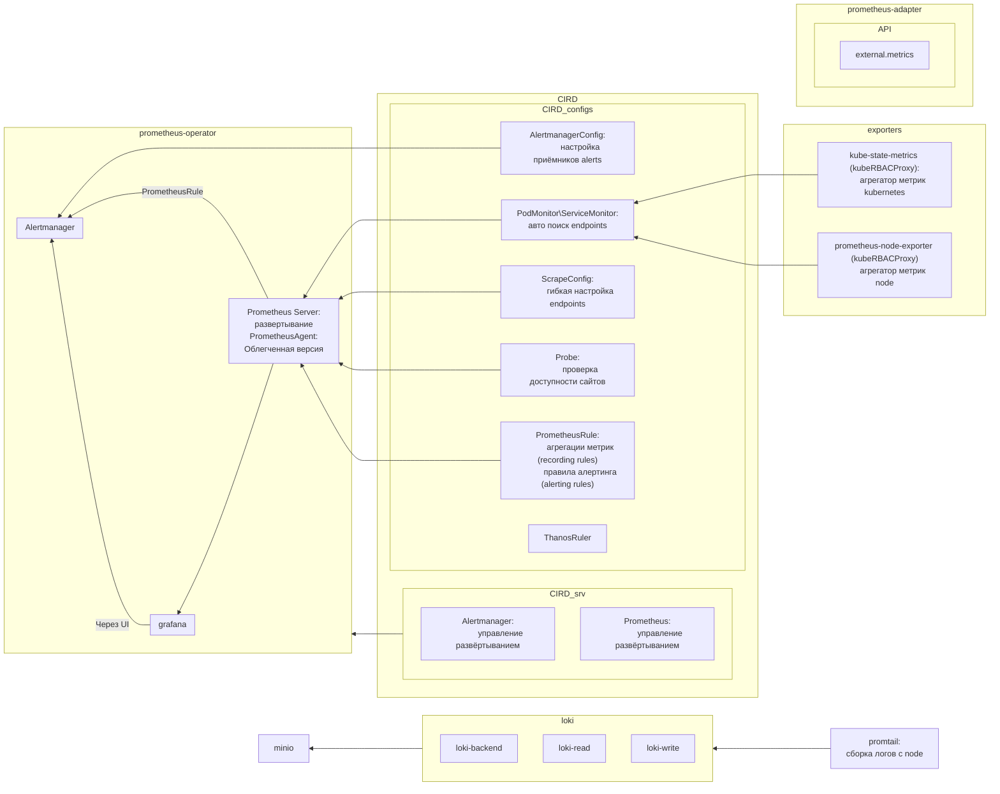

## 
Для правил выбрано локальное хранилище с загрузкой из cm. Причина:
С3:
Линейка Loki с хранилищем s3 работает следующим образом:

Поды loki-backend периодически сканируют контейнер S3. Он ищет двоичные файлы, содержащие данные правил. Имена файлов основаны на хэше пространства имен Loki и других вещах.
Единственный способ добавить файлы правил в S3 — использовать API Loki. Правило, созданное вызовом API POST, добавляется в контейнер под /rules/{tenant_id}/{hash part2}/{hash part 2}.
Файлы правил (yaml, текстовые файлы и т. д.), добавленные в корзину вручную, игнорируются.
Модули loki-backend периодически сканируют контейнер S3, находят правила и создают их копию yaml в каждом модуле /var/loki/rules-temp/<org_id>/<namespace>. Эта временная папка является «рабочей областью», где линейка считывает правила.
Любые файлы, добавленные вручную,/var/loki/rules-temp игнорируются и удаляются.
Любые файлы, добавленные вручную /rules/, /var/loki/rulesигнорируются.
/loki/rulesдоступен только для чтения и, по-видимому, не используется.
Для успешного добавления правил в S3 используйте API.

Локальная файловая система модуля
Поды loki-backend монтируются emptyDirв /rules. Сначала в нем нет файлов. Но у backend statefulset также есть k8s-sidecar, чья задача — искать configMaps и secrets для метки (по вашему выбору). Эти configMaps и secrets содержат правила. Sidecar скопирует эти правила в файлы в /rules/{tenant_id}папке, тем самым сделав их доступными для правителя.
внутренняя линейка периодически сканирует /rules/{tenant_id}и загружает все найденные правила.
Значения sidecar:helm применяются к контейнеру init в наборе состояний loki-backend.

Нет необходимости настраивать extraVolumeили extraVolumeMounts. Они в любом случае игнорируются, когда Helm Chart создает sidecar, поэтому использовать их бессмысленно. Нет способа указать Helm Chart заменить или переименовать volumeMount по умолчанию sc-rules-volume, поэтому лучше использовать значение по умолчанию.





## CIRD
```shell
# Проверка установки
kubectl api-resources --sort-by=name | grep monitoring

# Проверка prometheus-adapter
kubectl get  apiservice -A | grep metrics


# Проверка правил loki
# Файл с правилами
curl -v -k https://loki-backend.monitoring.svc:3100/api/prom/rules
# Сами правилами
curl -v -k https://loki-backend.monitoring.svc:3100/prometheus/api/v1/rules
# Алерты на отправку а manager
curl -v -k /prometheus/api/v1/alerts
```
