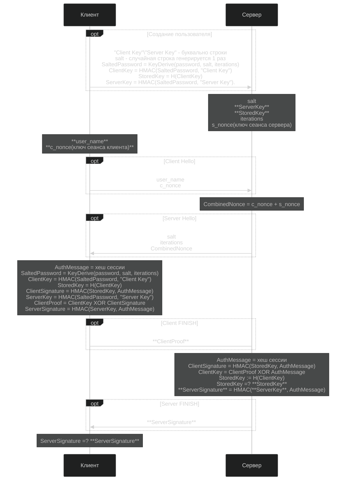

```mermaid
%%{init: {
  'theme': 'dark',
  'fontSize': '16px',
  'themeCSS': "text { font-size: 16px !important; }, .actor { font-weight: 600 !important; }",
  
  'fontFamily': 'sans-serif',
  'sequence': {

  }
}}%%
sequenceDiagram
    opt Создание пользователя
        Клиент->>Сервер: "Client Key"\"Server Key" - буквально строки<br>salt - случайная строка генерируется 1 раз<br>SaltedPassword = KeyDerive(password, salt, iterations)<br>ClientKey = HMAC(SaltedPassword, "Client Key")<br>StoredKey = H(ClientKey)<br>ServerKey = HMAC(SaltedPassword, "Server Key").
    end
    note over Сервер: salt<br>**ServerKey**<br>**StoredKey**<br>iterations<br>s_nonce(ключ сеанса сервера)
    note over Клиент: **user_name**<br/>**c_nonce(ключ сеанса клиента)**
    opt Client Hello
        Клиент->>Сервер: user_name<br>c_nonce
    end
    note over Сервер: CombinedNonce = c_nonce + s_nonce
    opt Server Hello
        Сервер->>Клиент: salt<br>iterations<br>CombinedNonce
    end
    note over Клиент: AuthMessage = хеш сессии<br>SaltedPassword = KeyDerive(password, salt, iterations)<br>ClientKey = HMAC(SaltedPassword, "Client Key")<br>StoredKey = H(ClientKey)<br>ClientSignature = HMAC(StoredKey, AuthMessage)<br>ServerKey = HMAC(SaltedPassword, "Server Key")<br>ClientProof = ClientKey XOR ClientSignature<br>ServerSignature = HMAC(ServerKey, AuthMessage)
    opt Client FINISH
        Клиент->Сервер: **ClientProof**
    end
    note over Сервер: AuthMessage = хеш сессии<br>ClientSignature = HMAC(StoredKey, AuthMessage)<br>ClientKey = ClientProof XOR AuthMessage<br>StoredKey := H(ClientKey)<br>StoredKey =? **StoredKey**<br>**ServerSignature** = HMAC(**ServerKey**, AuthMessage)

    opt Server FINISH
        Сервер ->> Клиент: **ServerSignature**
    end
    note over Клиент: ServerSignature =? **ServerSignature**
      
```